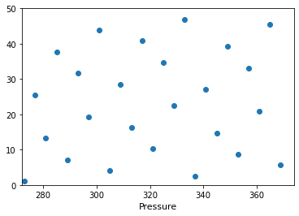
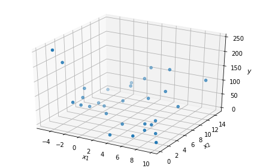
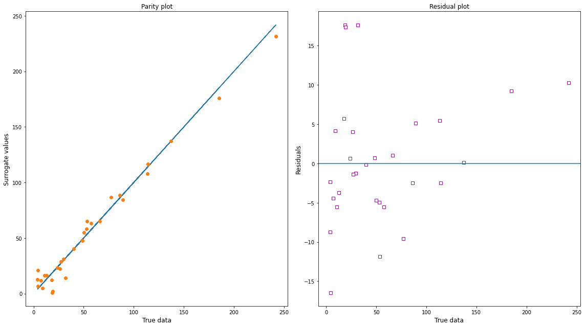

PySMO Tutorial
==============

**Python-based Surrogate Modelling Objects** (PySMO) provides tools for
generating different types of reduced order models. PySMO currently
provides tools for sampling and surrogate model generation.

Installation
------------

**PySMO** is installed by default as part of IDAES. For instructions on
installing IDAES, see the `online
documentation <https://idaes-pse.readthedocs.io/en/stable/>`__.

One-Shot Sampling with PySMO
----------------------------

The PySMO package offers five common sampling methods for one-shot
design:

-  Latin Hypercube Sampling (LHS)
-  Full-Factorial Sampling
-  Halton Sampling
-  Hammersley Sampling
-  Centroidal voronoi tessellation (CVT) sampling

PySMO provides two modes for data sampling: creation and selection. - In
creation mode, PySMO creates a specified number of sample points from
the bounds provided by the user. - In selection mode, PySMO selects a
specified number of data points from a user-supplied dataset or file.

Generating samples:
~~~~~~~~~~~~~~~~~~~

For demonstration purposes, let us consider a problem for which we need
twenty-five (25) samples of temperature and pressure from within the
ranges T = 273K - 373K, P = 1 MPa - 50 MPa. Let us generate these
samples in PySMO.

Step 1: Import PySMO's sampling tool
^^^^^^^^^^^^^^^^^^^^^^^^^^^^^^^^^^^^

For this demonstration, we will attempt to generate the samples using
the Hammersley sampling method.

.. code:: ipython3

    from idaes.surrogate.pysmo.sampling import HammersleySampling

Step 2: Specify sampling information and initialize class
^^^^^^^^^^^^^^^^^^^^^^^^^^^^^^^^^^^^^^^^^^^^^^^^^^^^^^^^^

All the sampling tools (except full-factorial sampling) require the same
keyword arguments:

::

          -  data_input             : must be a list of lists containing the problem bounds (when creating points), 
                                      or an input dataset (when selecting points from a dataset)
          -  number_of_samples      : number of samples to be created or selected.
          -  sampling_type          : "creation" or "selection".

For full factorial sampling, the user needs to enter a list of points in
each dimension in place of the number of samples. Full-factorial
sampling requires other inputs - details may be found in the
`documentation <https://idaes-pse.readthedocs.io/en/stable/surrogate/pysmo/index.html>`__.

For our example, we will create the bounds and then initialize the class
with the number of samples.

.. code:: ipython3

    bounds_info = [[273, 1],[373, 50]]
    init_data = HammersleySampling(data_input=bounds_info, number_of_samples=25, sampling_type="creation")

.. parsed-literal::

    Sampling type:  creation 
    

Step 3: Create the samples
^^^^^^^^^^^^^^^^^^^^^^^^^^

The samples are created by calling the ``sample_points`` method on the
initialized class.

.. code:: ipython3

    samples = init_data.sample_points()
    print(samples)

.. parsed-literal::

    [[273.        1.     ]
     [277.       25.5    ]
     [281.       13.25   ]
     [285.       37.75   ]
     [289.        7.125  ]
     [293.       31.625  ]
     [297.       19.375  ]
     [301.       43.875  ]
     [305.        4.0625 ]
     [309.       28.5625 ]
     [313.       16.3125 ]
     [317.       40.8125 ]
     [321.       10.1875 ]
     [325.       34.6875 ]
     [329.       22.4375 ]
     [333.       46.9375 ]
     [337.        2.53125]
     [341.       27.03125]
     [345.       14.78125]
     [349.       39.28125]
     [353.        8.65625]
     [357.       33.15625]
     [361.       20.90625]
     [365.       45.40625]
     [369.        5.59375]]

Simple as that, the samples have been created!

Now, let us visualize the samples in a 2-D plot.

Step 4: Visualize samples with matplotlib
^^^^^^^^^^^^^^^^^^^^^^^^^^^^^^^^^^^^^^^^^

.. code:: ipython3

    from matplotlib import pyplot as plt
    plt.plot(samples[:, 0], samples[:, 1], 'o')
    plt.xlabel(r'Temperature', fontsize=11)
    plt.xlabel(r'Pressure', fontsize=11)
    plt.xlim(272, 374)
    plt.ylim(0, 50)
    plt.show()

Generating surrogates with PySMO
--------------------------------

PySMO currently provides tools for generating three types of surrogates:

-  Polynomial surrogates
-  Radial basis function (RBF) surrogates, and
-  Kriging surrogates

Details about thee various methods may be found in the
`documentation <https://idaes-pse.readthedocs.io/en/stable/surrogate/pysmo/index.html>`__.

Generating polynomial models
~~~~~~~~~~~~~~~~~~~~~~~~~~~~

The ``PolynomialRegression`` class trains polynomial models from data.

As an example, let us generate a surrogate for the Brainin function.

The true Brainin function is given by the expression:

.. raw:: latex

   \begin{gather}
   \hat{y}(x_{1},x_{2})=\left(x_{2}-\frac{5.1x_{1}^{2}}{4\pi^{2}}+\frac{5x_{1}}{\pi}-6\right)^{2}+10\left[\left(1-\frac{1}{8\pi}\right)\cos\left(x_{1}\right)+1\right]+5x_{1}\nonumber \\
   x_{1}\in\left[-5,10\right];x_{2}\in\left[0,15\right]
   \end{gather}

We have generated 30 points from the function and saved the information
in a text file called "brainin\_30.txt". We will use this data to train
a simple polynomial model. The data is in XY format, with the outputs
:math:`y` in the third column.

Step 1: Import and visualize the data
^^^^^^^^^^^^^^^^^^^^^^^^^^^^^^^^^^^^^

.. code:: ipython3

    import numpy as np
    brainin_data = np.loadtxt('brainin_30.txt')
    print(brainin_data,'\n\nDataset shape:', brainin_data.shape)

.. parsed-literal::

    [[ 3.15107413e+00  4.17554078e+00  4.03815759e+00]
     [ 1.36776386e+00  1.26716420e+01  8.60127077e+01]
     [-4.92921716e+00  1.82353681e+00  2.41888089e+02]
     [ 5.06123627e+00  1.23877913e+01  1.37242426e+02]
     [-2.94940115e+00  8.62639994e+00  1.07587601e+01]
     [ 8.36982931e+00  3.13803183e+00  7.24964869e+00]
     [-2.22007671e+00  1.62565336e+00  7.71988248e+01]
     [-1.70453761e+00  1.46793568e+01  3.99820398e+01]
     [ 7.17524724e+00  2.57911519e+00  1.78453527e+01]
     [ 7.24337123e+00  4.11110621e+00  2.36937839e+01]
     [ 1.47556275e+00  1.41004473e+01  1.14292050e+02]
     [ 7.26474068e+00  5.04167925e+00  2.96703147e+01]
     [-2.36884319e+00  5.59248069e+00  2.71582680e+01]
     [-4.91467239e+00  3.78639530e+00  1.84993457e+02]
     [ 6.93493763e+00  2.28824569e-01  1.85302363e+01]
     [ 3.98265065e+00  9.05706809e+00  5.75698037e+01]
     [-3.42278472e+00  5.72915167e+00  5.30702398e+01]
     [-4.45285915e+00  1.33561735e+01  1.27882794e+01]
     [ 9.71381286e+00  8.99129832e-01  4.14567857e+00]
     [ 8.35818917e+00  8.65352249e+00  5.34055688e+01]
     [ 6.13719534e+00  9.45275905e+00  8.93001840e+01]
     [ 3.72763289e+00  3.06586980e-01  4.42072359e+00]
     [-1.84960133e+00  8.17027317e+00  8.83431235e+00]
     [ 6.53672757e+00  3.76042844e+00  2.62862798e+01]
     [-7.11564644e-01  1.27859263e+01  4.84986100e+01]
     [ 9.62509740e+00  1.32727994e+01  1.13457908e+02]
     [ 3.92617659e-01  8.98288419e+00  3.17439666e+01]
     [ 3.21934175e-01  5.10285323e+00  1.92673649e+01]
     [-2.32878516e+00  3.56541313e+00  5.02034858e+01]
     [-4.32706576e+00  7.58147144e+00  6.60457721e+01]] 
    
    Dataset shape: (30, 3)

Let us visualize the data:

.. code:: ipython3

    from mpl_toolkits.mplot3d import Axes3D 
    from matplotlib import pyplot as plt
    fig1 = plt.figure(figsize=(6, 4), tight_layout=True)
    ax = fig1.add_subplot(111, projection='3d')
    ax.scatter3D(brainin_data[:, 0], brainin_data[:, 1], brainin_data[:, 2], cmap=brainin_data[:, 2])
    ax.set_xlabel(r'$x_{1}$', fontsize=11)
    ax.set_ylabel(r'$x_{2}$', fontsize=11)
    ax.set_zlabel(r'$y$', fontsize=11)

.. parsed-literal::

    Text(0.5, 0, '$y$')

Step 2: Import the polynomial model tool
^^^^^^^^^^^^^^^^^^^^^^^^^^^^^^^^^^^^^^^^

.. code:: ipython3

    from idaes.surrogate.pysmo.polynomial_regression import PolynomialRegression

Step 3: Specify the regression settings and initialize the PolynomialRegression class
^^^^^^^^^^^^^^^^^^^^^^^^^^^^^^^^^^^^^^^^^^^^^^^^^^^^^^^^^^^^^^^^^^^^^^^^^^^^^^^^^^^^^

The PolynomialRegression class takes a keyword arguments:

::

      -  original_data_input           : The dataset for regression training. training_data is expected to contain xy_data, 
                                         with the output values (y) in the last column.
      -  regression_data_input         : same as above
      -  maximum_polynomial_order      : maximum order of the polynomial to be generated  

It also takes a number of optional arguments:

::

      - multinomials                  : True/False option for specifying second-order bi-variate terms. default is False
      - training_split                : The training/cross-validation split of training data. Must be between 0 and 1. 
                                        Default is 0.75
      - fname                         : Filename for saving results (.pickle extension). 
      - overwrite                     : Option determining whether any existing file with the same name supplied in 'fname'  
                                        should be overwritten.

For this example, let us consider a 4th order polynomial with
interaction terms. We will split the data 80/20 betweeen training and
cross-validation.

.. code:: ipython3

    poly_class = PolynomialRegression(original_data_input=brainin_data, regression_data_input=brainin_data, 
                                      maximum_polynomial_order=4, multinomials=1, training_split=0.8, number_of_crossvalidations=10, overwrite=True)

.. parsed-literal::

    
    ===========================Polynomial Regression===============================================
    
    No iterations will be run.
    Default parameter estimation method is used.
    Parameter estimation method:  pyomo 
    

Step 4: Extract variable names
^^^^^^^^^^^^^^^^^^^^^^^^^^^^^^

Next, we extract Pyomo variable names from the dataset. This should be
done always.

.. code:: ipython3

    vars = poly_class.get_feature_vector()

We can view the variables using Pyomo's pprint function:

.. code:: ipython3

    vars.pprint()

.. parsed-literal::

    IndexedParam : Size=2, Index={0, 1}, Domain=Any, Default=None, Mutable=True
        Key : Value
          0 :     0
          1 :     0

Step 5: Specify additional regression terms, if required.
^^^^^^^^^^^^^^^^^^^^^^^^^^^^^^^^^^^^^^^^^^^^^^^^^^^^^^^^^

This is one of the unique features of PySMO - it allows the user to
specify additional regression features if they want. The additional
features must be specified in terms of the Pyomo variables created when
calling the ``get_feature_vector()``

For this example, let us create three additional features:
:math:`x_{1}^{2}x_{2}^{2}`, :math:`exp(x_1)` and :math:`exp(x_2)`. We do
this by calling the ``set_additional_terms`` function:

.. code:: ipython3

    from pyomo.environ import exp
    poly_class.set_additional_terms([vars[0] * vars[0] * vars[1] * vars[1], exp(vars[0]), exp(vars[1])])

That's it - those features will now exist in the model.

Note that ``set_additional_terms`` an optional call - the regression
process works just fine without it.

Step 6: Train the surrogate and view results
^^^^^^^^^^^^^^^^^^^^^^^^^^^^^^^^^^^^^^^^^^^^

Next, we train the polynomial surrogate by calling ``poly_training``:

.. code:: ipython3

    result = poly_class.poly_training()

.. parsed-literal::

    WARNING: DEPRECATED: Note that the API for the StreamBasedExpressionVisitor
        has changed to include the child index for the beforeChild() method.
        Please update your walker callbacks. (called from
        /home/ksb/anaconda3/envs/examples-rel/lib/python3.7/site-
        packages/idaes/surrogate/pysmo/utils.py:58)
    No iterations will be run.
    
    Best surrogate model is of order 3  with a cross-val S.S. Error  of 19.737617
    
    ------------------------------------------------------------
    The final coefficients of the regression terms are: 
    
    k               | 57.607003
    (x_ 1 )^ 1      | -19.078561
    (x_ 2 )^ 1      | -17.191563
    (x_ 1 )^ 2      | 3.889924
    (x_ 2 )^ 2      | 1.163328
    (x_ 1 )^ 3      | -0.351928
    (x_ 2 )^ 3      | 0.018398
    x_ 1 .x_ 2      | 3.100135
    
    The coefficients of the extra terms in additional_regression_features are:
    
    Coeff. additional_regression_features[ 1 ]:  -0.017933
    Coeff. additional_regression_features[ 2 ]:  0.004746
    Coeff. additional_regression_features[ 3 ]:  -1.3e-05
    
    Regression model performance on training data:
    Order:  3  / MAE: 6.154513  / MSE: 65.995248  / R^2: 0.978531
    
    Results saved in  solution.pickle

The polynomial model seems to fit well based on the :math:`R^2`. It
should be noted that the metrics are only an indication of how well of
how well the model fit the training data - the user needs to verify the
model's performance on a test data set if possible.

We can view the parity and residual plots for the fit:

.. code:: ipython3

    poly_class.parity_residual_plots(result)

PySMO is also able to compute the confidence intervals on the regression
coefficients obtained by calling ``confint_regression()``. This is left
as an exercise for the user.

Step 8 (Optional): Generate Pyomo expression
^^^^^^^^^^^^^^^^^^^^^^^^^^^^^^^^^^^^^^^^^^^^

If the user wishes, they can generate the Pyomo expression for the
polynomial fit using PySMO's ``generate_expression``.

To do this, the user must pass in a list of Pyomo variables
corresponding to each variable in the input dataset. The user should
note that ``generate_expression`` should be called on the result object,
not the class object.

As a demonstration, let us create the variables :math:`x_1` and
:math:`x_2` and generate the pyomo expression based on them:

.. code:: ipython3

    from pyomo.environ import Var, ConcreteModel
    m = ConcreteModel()
    m.x = Var([1, 2])
    print(result.generate_expression([m.x[1], m.x[2]]))

.. parsed-literal::

    57.607003493336926 - 19.078560846647864*x[1] - 17.191563036636072*x[2] + 3.8899241750056417*x[1]**2 + 1.163328032136834*x[2]**2 - 0.35192841345420534*x[1]**3 + 0.018398180895006194*x[2]**3 + 3.100134835673136*(x[2]*x[1]) - 0.017933037213860928*(x[1]*x[1]*x[2]*x[2]) + 0.004745711043397452*exp(x[1]) - 1.297532026006687e-05*exp(x[2])

Step 9 (Optional): Predict output at any unsampled point
^^^^^^^^^^^^^^^^^^^^^^^^^^^^^^^^^^^^^^^^^^^^^^^^^^^^^^^^

Based on the model we trained, we can predict the surrogate value at any
previously unsampled point.

Let us evaluate the surrogate at three points:

-  :math:`x_{1}=5`, :math:`x_{2}=8` (true function value: 57.9908)
-  :math:`x_{1}=-3`, :math:`x_{2}=10` (true function value: 4.2461)
-  :math:`x_{1}=-2`, :math:`x_{2}=3`. (true function value: 50.8899)

We will pass the points in as an array.

.. code:: ipython3

    unsampled_points = np.array([ [5, 8], [-3, 10], [-2, 3]])
    ys = poly_class.poly_predict_output(result, unsampled_points)
    print(ys)

.. parsed-literal::

    [[57.7897913 ]
     [12.74008178]
     [54.28524655]]

The model performs fairly well in predicting the value at two of our
sampled points but is off on the value at [-3, 2]. For better model
performance, additional training data is needed in this region. We will
leave this to the user to try.

Further information about using PySMO's polynomial regression tool can
be found in the
`documentation <https://idaes-pse.readthedocs.io/en/stable/surrogate/pysmo/pysmo_polyregression.html>`__.

Generating RBF models
~~~~~~~~~~~~~~~~~~~~~

The ``RadialBasisFunction`` class trains RBF models from data. For
details about RBF models, the user should consult the documentation.

As an example, we will again consider the Brainin function. The same
dataset loaded previously will be used.

Step 1: Import the data and the RBF tool
^^^^^^^^^^^^^^^^^^^^^^^^^^^^^^^^^^^^^^^^

.. code:: ipython3

    import numpy as np
    brainin_data = np.loadtxt('brainin_30.txt')
    from idaes.surrogate.pysmo.radial_basis_function import RadialBasisFunctions

Step 2: Specify the RBF settings and initialize the RadialBasisFunctions class
^^^^^^^^^^^^^^^^^^^^^^^^^^^^^^^^^^^^^^^^^^^^^^^^^^^^^^^^^^^^^^^^^^^^^^^^^^^^^^

The RadialBasisFunctions class takes a number of keyword arguments:

::

      -  XY_data                       : The dataset forRBF training. training_data is expected to contain xy_data, 
                                         with the output values (y) in the last column.

It also takes a number of optional arguments:

::

      -  regularization                : Boolean variable determining whether regularization is done. Default is True.
      -  basis_function                : Basis function transformation to be applied to the training data. PySMO offers 
                                         six basis function types including the Gaussian and Spline transformations. User 
                                         should consult documentation for full list of options.   
      -  fname                         : Filename for saving (.pickle extension)
      - overwrite                      : Option determining whether any existing file with the same name supplied in 'fname'  
                                         should be overwritten.

For this demonstration, we will train an RBF model with a Gaussian basis
function:

.. code:: ipython3

    rbf_class = RadialBasisFunctions(XY_data=brainin_data, basis_function='gaussian', overwrite=True)

.. parsed-literal::

    Warning: solution.pickle already exists; previous file will be overwritten.
    
    Default parameter estimation method is used.
    
    Parameter estimation method:  algebraic
    Basis function:  gaussian
    Regularization done:  True

Step 3: Extract variable names
^^^^^^^^^^^^^^^^^^^^^^^^^^^^^^

Next, we extract Pyomo variable names from the dataset.

.. code:: ipython3

    vars = rbf_class.get_feature_vector()

Step 4: Train the RBF surrogate
^^^^^^^^^^^^^^^^^^^^^^^^^^^^^^^

Next, we train the RBF surrogate by calling ``rbf_training``:

.. code:: ipython3

    result = rbf_class.rbf_training()

.. parsed-literal::

    ===========================================================================================================
    0.001    |     1e-05    |     1.330188999808371    |     4.3695602244234173e+18    |     970.2372737282288    |     2999999.799580579    |     6.661337702730428e-10
    0.001    |     2e-05    |     1.3231321486375325    |     4.3695602244234173e+18    |     970.2372737282288    |     1500000.3997435085    |     3.330669961484364e-10
    0.001    |     5e-05    |     1.3204882439275487    |     4.3695602244234173e+18    |     970.2372737282288    |     600000.759877815    |     1.3322693168178801e-10
    0.001    |     7.5e-05    |     1.3203184940691541    |     4.3695602244234173e+18    |     970.2372737282288    |     400000.83991663984    |     8.881802846897099e-11
    0.001    |     0.0001    |     1.320320912759758    |     4.3695602244234173e+18    |     970.2372737282288    |     300000.87993840926    |     6.661357686308583e-11
    0.001    |     0.0002    |     1.3204538291260948    |     4.3695602244234173e+18    |     970.2372737282288    |     150000.93996800235    |     3.330689945357842e-11
    0.001    |     0.0005    |     1.3206180157501706    |     4.3695602244234173e+18    |     970.2372737282288    |     60000.9759869437    |     1.3322893008137204e-11
    0.001    |     0.00075    |     1.3206637488447208    |     4.3695602244234173e+18    |     970.2372737282288    |     40000.98399127119    |     8.882002686954313e-12
    0.001    |     0.001    |     1.3206877851838508    |     4.3695602244234173e+18    |     970.2372737282288    |     30000.98799346284    |     6.661557526369064e-12
    0.001    |     0.002    |     1.3207246211571815    |     4.3695602244234173e+18    |     970.2372737282288    |     15000.993996717278    |     3.3308897854838543e-12
    0.001    |     0.005    |     1.3207441010685663    |     4.3695602244234173e+18    |     970.2372737282288    |     6000.99759868473    |     1.3324891409560125e-12
    0.001    |     0.0075    |     1.3207457685491846    |     4.3695602244234173e+18    |     970.2372737282288    |     4000.9983991224717    |     8.88400108838832e-13
    0.001    |     0.01    |     1.320744737958554    |     4.3695602244234173e+18    |     970.2372737282288    |     3000.99879934198    |     6.663555927803832e-13
    0.001    |     0.02    |     1.3207338807217233    |     4.3695602244234173e+18    |     970.2372737282288    |     1500.9993996709632    |     3.332888186926482e-13
    0.001    |     0.05    |     1.3206922424549317    |     4.3695602244234173e+18    |     970.2372737282288    |     600.9997598683258    |     1.3344875424000108e-13
    0.001    |     0.075    |     1.3206569542286999    |     4.3695602244234173e+18    |     970.2372737282288    |     400.9998399122128    |     8.903985102830809e-14
    0.001    |     0.1    |     1.3206222275255655    |     4.3695602244234173e+18    |     970.2372737282288    |     300.99987993415886    |     6.683539942246216e-14
    0.001    |     0.2    |     1.320490925394551    |     4.3695602244234173e+18    |     970.2372737282288    |     150.99993996707863    |     3.352872201369342e-14
    0.001    |     0.5    |     1.3201734897566477    |     4.3695602244234173e+18    |     970.2372737282288    |     60.99997598683122    |     1.3544715568432334e-14
    0.001    |     0.75    |     1.3199938819612353    |     4.3695602244234173e+18    |     970.2372737282288    |     40.99998399122082    |     9.103825247263236e-15
    0.001    |     1    |     1.319887628054723    |     4.3695602244234173e+18    |     970.2372737282288    |     30.999987993415584    |     6.883380086678677e-15
    0.002    |     1e-05    |     1.3623878222702834    |     2.811532029373447e+18    |     624.2855186962986    |     2999996.1978084585    |     6.661329705189752e-10
    0.002    |     2e-05    |     1.343994630875181    |     2.811532029373447e+18    |     624.2855186962986    |     1499998.5987441842    |     3.3306659624625295e-10
    0.002    |     5e-05    |     1.3272246485713795    |     2.811532029373447e+18    |     624.2855186962986    |     600000.039493236    |     1.3322677172427877e-10
    0.002    |     7.5e-05    |     1.3235440099199005    |     2.811532029373447e+18    |     624.2855186962986    |     400000.359657116    |     8.881792182993475e-11
    0.002    |     0.0001    |     1.32200371688543    |     2.811532029373447e+18    |     624.2855186962986    |     300000.51974127063    |     6.661349688325449e-11
    0.002    |     0.0002    |     1.3204880868270699    |     2.811532029373447e+18    |     624.2855186962986    |     150000.75986916633    |     3.330685946360353e-11
    0.002    |     0.0005    |     1.3203538501482828    |     2.811532029373447e+18    |     624.2855186962986    |     60000.90394759117    |     1.3322877012187633e-11
    0.002    |     0.00075    |     1.320438936129584    |     2.811532029373447e+18    |     624.2855186962986    |     40000.935965051714    |     8.881992022991384e-12
    0.002    |     0.001    |     1.3205000397653668    |     2.811532029373447e+18    |     624.2855186962986    |     30000.9519737753    |     6.661549528391775e-12
    0.002    |     0.002    |     1.320615846455798    |     2.811532029373447e+18    |     624.2855186962986    |     15000.975986867108    |     3.3308857864937887e-12
    0.002    |     0.005    |     1.3206969267656161    |     2.811532029373447e+18    |     624.2855186962986    |     6000.990394745487    |     1.3324875413601693e-12
    0.002    |     0.0075    |     1.3207137929011332    |     2.811532029373447e+18    |     624.2855186962986    |     4000.9935964961605    |     8.883990424415701e-13
    0.002    |     0.01    |     1.3207205715037704    |     2.811532029373447e+18    |     624.2855186962986    |     3000.9951973719417    |     6.663547929823691e-13
    0.002    |     0.02    |     1.3207216922930898    |     2.811532029373447e+18    |     624.2855186962986    |     1500.9975986859233    |     3.3328841879363654e-13
    0.002    |     0.05    |     1.3206873938685033    |     2.811532029373447e+18    |     624.2855186962986    |     600.9990394743229    |     1.3344859428039932e-13
    0.002    |     0.075    |     1.3206537523643638    |     2.811532029373447e+18    |     624.2855186962986    |     400.99935964954426    |     8.90397443885736e-14
    0.002    |     0.1    |     1.3206198511578067    |     2.811532029373447e+18    |     624.2855186962986    |     300.99951973715935    |     6.683531944266171e-14
    0.002    |     0.2    |     1.3204897899439871    |     2.811532029373447e+18    |     624.2855186962986    |     150.99975986857848    |     3.3528682023793106e-14
    0.002    |     0.5    |     1.3201731005146322    |     2.811532029373447e+18    |     624.2855186962986    |     60.99990394743119    |     1.3544699572472217e-14
    0.002    |     0.75    |     1.3199936589276797    |     2.811532029373447e+18    |     624.2855186962986    |     40.99993596495411    |     9.103814583289818e-15
    0.002    |     1    |     1.3198874884067833    |     2.811532029373447e+18    |     624.2855186962986    |     30.999951973715564    |     6.883372088698617e-15
    0.005    |     1e-05    |     1.398281393998564    |     1.993110643912039e+19    |     4425.594654993234    |     2999970.9840584164    |     6.661273719418085e-10
    0.005    |     2e-05    |     1.3887224316231532    |     1.993110643912039e+19    |     4425.594654993234    |     1499985.9919956021    |     3.3306379698574465e-10
    0.005    |     5e-05    |     1.3683630926252979    |     1.993110643912039e+19    |     4425.594654993234    |     599994.9967722278    |     1.3322565201528476e-10
    0.005    |     7.5e-05    |     1.3574022549696767    |     1.993110643912039e+19    |     4425.594654993234    |     399996.9978452804    |     8.881717535775388e-11
    0.005    |     0.0001    |     1.349656526520873    |     1.993110643912039e+19    |     4425.594654993234    |     299997.998385878    |     6.661293702989246e-11
    0.005    |     0.0002    |     1.3338899892287988    |     1.993110643912039e+19    |     4425.594654993234    |     149999.4991912911    |     3.330657953688279e-11
    0.005    |     0.0005    |     1.3231314606156714    |     1.993110643912039e+19    |     4425.594654993234    |     60000.399676470224    |     1.3322765041505807e-11
    0.005    |     0.00075    |     1.3213658709058143    |     1.993110643912039e+19    |     4425.594654993234    |     40000.5997841317    |     8.881917375831816e-12
    0.005    |     0.001    |     1.3207434325087575    |     1.993110643912039e+19    |     4425.594654993234    |     30000.699838095847    |     6.661493543024443e-12
    0.005    |     0.002    |     1.3203109441737368    |     1.993110643912039e+19    |     4425.594654993234    |     15000.849919037839    |     3.330857793812445e-12
    0.005    |     0.005    |     1.320447359256412    |     1.993110643912039e+19    |     4425.594654993234    |     6000.939967613105    |     1.3324763442874821e-12
    0.005    |     0.0075    |     1.3205266147948835    |     1.993110643912039e+19    |     4425.594654993234    |     4000.9599784082266    |     8.883915777265165e-13
    0.005    |     0.01    |     1.32057225113484    |     1.993110643912039e+19    |     4425.594654993234    |     3000.969983806046    |     6.663491944460911e-13
    0.005    |     0.02    |     1.3206416674457868    |     1.993110643912039e+19    |     4425.594654993234    |     1500.9849919029177    |     3.332856195254847e-13
    0.005    |     0.05    |     1.3206543062552798    |     1.993110643912039e+19    |     4425.594654993234    |     600.9939967611571    |     1.3344747457314667e-13
    0.005    |     0.075    |     1.320631717827661    |     1.993110643912039e+19    |     4425.594654993234    |     400.99599784076855    |     8.903899791707216e-14
    0.005    |     0.1    |     1.3206034290426685    |     1.993110643912039e+19    |     4425.594654993234    |     300.99699838057813    |     6.683475958903576e-14
    0.005    |     0.2    |     1.3204818942961345    |     1.993110643912039e+19    |     4425.594654993234    |     150.99849919028637    |     3.3528402096979796e-14
    0.005    |     0.5    |     1.32017038389415    |     1.993110643912039e+19    |     4425.594654993234    |     60.999399676114614    |     1.3544587601746952e-14
    0.005    |     0.75    |     1.3199921011576619    |     1.993110643912039e+19    |     4425.594654993234    |     40.99959978407644    |     9.103739936139651e-15
    0.005    |     1    |     1.3198865127506894    |     1.993110643912039e+19    |     4425.594654993234    |     30.999699838057264    |     6.883316103335982e-15
    0.0075    |     1e-05    |     1.40430059387764    |     4.47566436006882e+19    |     9937.971246085242    |     2999933.4646262457    |     6.661190409543151e-10
    0.0075    |     2e-05    |     1.3994032633192475    |     4.47566436006882e+19    |     9937.971246085242    |     1499967.2322744646    |     3.3305963149087615e-10
    0.0075    |     5e-05    |     1.3868056479470163    |     4.47566436006882e+19    |     9937.971246085242    |     599987.4928856954    |     1.3322398581776427e-10
    0.0075    |     7.5e-05    |     1.3783815287742158    |     4.47566436006882e+19    |     9937.971246085242    |     399991.9952557941    |     8.88160645597478e-11
    0.0075    |     0.0001    |     1.3714017808041383    |     4.47566436006882e+19    |     9937.971246085242    |     299994.24643758504    |     6.661210393001605e-11
    0.0075    |     0.0002    |     1.3527834516572557    |     4.47566436006882e+19    |     9937.971246085242    |     149997.62321917663    |     3.330616298739578e-11
    0.0075    |     0.0005    |     1.3320471009303658    |     4.47566436006882e+19    |     9937.971246085242    |     59999.649287072076    |     1.3322598421588355e-11
    0.0075    |     0.00075    |     1.326497256926867    |     4.47566436006882e+19    |     9937.971246085242    |     40000.09952470224    |     8.88180629592444e-12
    0.0075    |     0.001    |     1.3239147582317867    |     4.47566436006882e+19    |     9937.971246085242    |     30000.324643490636    |     6.661410233086559e-12
    0.0075    |     0.002    |     1.3209497744221532    |     4.47566436006882e+19    |     9937.971246085242    |     15000.66232173415    |     3.330816138843262e-12
    0.0075    |     0.005    |     1.3203066752601995    |     4.47566436006882e+19    |     9937.971246085242    |     6000.864928690339    |     1.3324596822995225e-12
    0.0075    |     0.0075    |     1.320357289144845    |     4.47566436006882e+19    |     9937.971246085242    |     4000.909952460298    |     8.883804697346727e-13
    0.0075    |     0.01    |     1.320414945360624    |     4.47566436006882e+19    |     9937.971246085242    |     3000.932464345166    |     6.66340863452223e-13
    0.0075    |     0.02    |     1.320539198594415    |     4.47566436006882e+19    |     9937.971246085242    |     1500.9662321724272    |     3.332814540285394e-13
    0.0075    |     0.05    |     1.3206077953595614    |     4.47566436006882e+19    |     9937.971246085242    |     600.9864928689666    |     1.3344580837436983e-13
    0.0075    |     0.075    |     1.3206001441008717    |     4.47566436006882e+19    |     9937.971246085242    |     400.9909952459715    |     8.903788711788684e-14
    0.0075    |     0.1    |     1.3205796752193624    |     4.47566436006882e+19    |     9937.971246085242    |     300.99324643447636    |     6.683392648964589e-14
    0.0075    |     0.2    |     1.320470314359398    |     4.47566436006882e+19    |     9937.971246085242    |     150.99662321723713    |     3.352798554728523e-14
    0.0075    |     0.5    |     1.3201663674229875    |     4.47566436006882e+19    |     9937.971246085242    |     60.9986492868946    |     1.3544420981869054e-14
    0.0075    |     0.75    |     1.3199897942613743    |     4.47566436006882e+19    |     9937.971246085242    |     40.99909952459633    |     9.103628856221031e-15
    0.0075    |     1    |     1.3198850669656146    |     4.47566436006882e+19    |     9937.971246085242    |     30.999324643447313    |     6.8832327933970456e-15
    0.01    |     1e-05    |     1.4061992061555508    |     1.4495943032227846e+19    |     3218.7459436067925    |     2999880.939020587    |     6.661073779269582e-10
    0.01    |     2e-05    |     1.403535514350604    |     1.4495943032227846e+19    |     3218.7459436067925    |     1499940.9693646585    |     3.330537999534441e-10
    0.01    |     5e-05    |     1.3956271825162994    |     1.4495943032227846e+19    |     3218.7459436067925    |     599976.9877246027    |     1.3322165320341976e-10
    0.01    |     7.5e-05    |     1.389760075246859    |     1.4495943032227846e+19    |     3218.7459436067925    |     399984.991812652    |     8.881450948298219e-11
    0.01    |     0.0001    |     1.384516426827723    |     1.4495943032227846e+19    |     3218.7459436067925    |     299988.99385934946    |     6.66109376233569e-11
    0.01    |     0.0002    |     1.3683402006563845    |     1.4495943032227846e+19    |     3218.7459436067925    |     149994.99692925828    |     3.330557983388844e-11
    0.01    |     0.0005    |     1.3439837129674004    |     1.4495943032227846e+19    |     3218.7459436067925    |     59998.59877133409    |     1.3322365160236346e-11
    0.01    |     0.00075    |     1.3350937119917754    |     1.4495943032227846e+19    |     3218.7459436067925    |     39999.39918083779    |     8.881650788347748e-12
    0.01    |     0.001    |     1.3301839804869764    |     1.4495943032227846e+19    |     3218.7459436067925    |     29999.799385640254    |     6.661293602414687e-12
    0.01    |     0.002    |     1.3231293127500174    |     1.4495943032227846e+19    |     3218.7459436067925    |     15000.399692801087    |     3.3307578235055785e-12
    0.01    |     0.005    |     1.3204830758443535    |     1.4495943032227846e+19    |     3218.7459436067925    |     6000.759877119369    |     1.3324363561649497e-12
    0.01    |     0.0075    |     1.3203100371670153    |     1.4495943032227846e+19    |     3218.7459436067925    |     4000.8399180792717    |     8.883649189782065e-13
    0.01    |     0.01    |     1.3203089432056954    |     1.4495943032227846e+19    |     3218.7459436067925    |     3000.8799385589286    |     6.663292003847695e-13
    0.01    |     0.02    |     1.3204273423452135    |     1.4495943032227846e+19    |     3218.7459436067925    |     1500.9399692794284    |     3.332756224948393e-13
    0.01    |     0.05    |     1.3205480387004707    |     1.4495943032227846e+19    |     3218.7459436067925    |     600.9759877117679    |     1.3344347576088996e-13
    0.01    |     0.075    |     1.3205583477737117    |     1.4495943032227846e+19    |     3218.7459436067925    |     400.9839918078363    |     8.9036332042233e-14
    0.01    |     0.1    |     1.3205477786808837    |     1.4495943032227846e+19    |     3218.7459436067925    |     300.98799385587535    |     6.683276018290559e-14
    0.01    |     0.2    |     1.3204544411843473    |     1.4495943032227846e+19    |     3218.7459436067925    |     150.99399692793614    |     3.352740239391497e-14
    0.01    |     0.5    |     1.32016079672088    |     1.4495943032227846e+19    |     3218.7459436067925    |     60.99759877117427    |     1.3544187720520965e-14
    0.01    |     0.75    |     1.3199865871021217    |     1.4495943032227846e+19    |     3218.7459436067925    |     40.99839918078274    |     9.103473348655631e-15
    0.01    |     1    |     1.3198830550759422    |     1.4495943032227846e+19    |     3218.7459436067925    |     30.998799385587112    |     6.883116162722994e-15
    0.02    |     1e-05    |     1.3991967821655091    |     3.4927959077947735e+18    |     775.5564874300566    |     2999520.8079331056    |     6.660274127619172e-10
    0.02    |     2e-05    |     1.4033527820006475    |     3.4927959077947735e+18    |     775.5564874300566    |     1499760.9038927003    |     3.330138173868625e-10
    0.02    |     5e-05    |     1.4040547659104747    |     3.4927959077947735e+18    |     775.5564874300566    |     599904.9615295489    |     1.3320566017539478e-10
    0.02    |     7.5e-05    |     1.4028711082087797    |     3.4927959077947735e+18    |     775.5564874300566    |     399936.97435071255    |     8.880384746461635e-11
    0.02    |     0.0001    |     1.4014091897445364    |     3.4927959077947735e+18    |     775.5564874300566    |     299952.98076238215    |     6.660294110946866e-11
    0.02    |     0.0002    |     1.39525137629867    |     3.4927959077947735e+18    |     775.5564874300566    |     149976.99038121718    |     3.330158157704259e-11
    0.02    |     0.0005    |     1.3796701173933186    |     3.4927959077947735e+18    |     775.5564874300566    |     59991.39615212983    |     1.3320765857500712e-11
    0.02    |     0.00075    |     1.3699232085652564    |     3.4927959077947735e+18    |     775.5564874300566    |     39994.59743472021    |     8.880584586528119e-12
    0.02    |     0.001    |     1.3622921102964258    |     3.4927959077947735e+18    |     775.5564874300566    |     29996.198076033666    |     6.66049395104588e-12
    0.02    |     0.002    |     1.3439496124691208    |     3.4927959077947735e+18    |     775.5564874300566    |     14998.599038014556    |     3.3303579978248967e-12
    0.02    |     0.005    |     1.3272089427378835    |     3.4927959077947735e+18    |     775.5564874300566    |     6000.0396152030125    |     1.3322764258922898e-12
    0.02    |     0.0075    |     1.323532461862649    |     3.4927959077947735e+18    |     775.5564874300566    |     4000.3597434683575    |     8.88258298796431e-13
    0.02    |     0.01    |     1.3219923714905966    |     3.4927959077947735e+18    |     775.5564874300566    |     3000.5198076010665    |     6.662492352485098e-13
    0.02    |     0.02    |     1.3204676186157425    |     3.4927959077947735e+18    |     775.5564874300566    |     1500.7599038004887    |     3.332356399267075e-13
    0.02    |     0.05    |     1.3202928659769564    |     3.4927959077947735e+18    |     775.5564874300566    |     600.9039615201867    |     1.3342748273363608e-13
    0.02    |     0.075    |     1.3203431410941715    |     3.4927959077947735e+18    |     775.5564874300566    |     400.93597434679083    |     8.902567002406566e-14
    0.02    |     0.1    |     1.3203699372606277    |     3.4927959077947735e+18    |     775.5564874300566    |     300.9519807600894    |     6.682476366927967e-14
    0.02    |     0.2    |     1.320356005679441    |     3.4927959077947735e+18    |     775.5564874300566    |     150.97599038004518    |     3.352340413710246e-14
    0.02    |     0.5    |     1.3201242272878078    |     3.4927959077947735e+18    |     775.5564874300566    |     60.99039615201786    |     1.3542588417795955e-14
    0.02    |     0.75    |     1.3199652973344642    |     3.4927959077947735e+18    |     775.5564874300566    |     40.99359743467855    |     9.102407146838975e-15
    0.02    |     1    |     1.3198696409051942    |     3.4927959077947735e+18    |     775.5564874300566    |     30.995198076008943    |     6.882316511360496e-15
    0.05    |     1e-05    |     1.1802626763414836    |     2.257675684117016e+19    |     5013.047053286126    |     2997002.1306371544    |     6.65468154056804e-10
    0.05    |     2e-05    |     1.2638668839615237    |     2.257675684117016e+19    |     5013.047053286126    |     1498501.5652486444    |     3.327341880351763e-10
    0.05    |     5e-05    |     1.3399914336659624    |     2.257675684117016e+19    |     5013.047053286126    |     599401.2260928655    |     1.3309380843936968e-10
    0.05    |     7.5e-05    |     1.3607917455522265    |     2.257675684117016e+19    |     5013.047053286126    |     399601.1507260419    |     8.872927964055186e-11
    0.05    |     0.0001    |     1.3717399149158767    |     2.257675684117016e+19    |     5013.047053286126    |     299701.1130423507    |     6.65470152410809e-11
    0.05    |     0.0002    |     1.3883571964184067    |     2.257675684117016e+19    |     5013.047053286126    |     149851.0565199867    |     3.3273618642578986e-11
    0.05    |     0.0005    |     1.3960809195488029    |     2.257675684117016e+19    |     5013.047053286126    |     59941.022607941646    |     1.3309580683782773e-11
    0.05    |     0.00075    |     1.395825918789991    |     2.257675684117016e+19    |     5013.047053286126    |     39961.01507186438    |     8.873127804035347e-12
    0.05    |     0.001    |     1.3944270862078108    |     2.257675684117016e+19    |     5013.047053286126    |     29971.011303895106    |     6.654901364177036e-12
    0.05    |     0.002    |     1.3868038656182333    |     2.257675684117016e+19    |     5013.047053286126    |     14986.005651939307    |     3.3275617043891498e-12
    0.05    |     0.005    |     1.367610236733624    |     2.257675684117016e+19    |     5013.047053286126    |     5995.002260776435    |     1.331157908518773e-12
    0.05    |     0.0075    |     1.3569104532323997    |     2.257675684117016e+19    |     5013.047053286126    |     3997.0015071831526    |     8.875126205472378e-13
    0.05    |     0.01    |     1.349296442539506    |     2.257675684117016e+19    |     5013.047053286126    |     2998.0011303872425    |     6.656899765616325e-13
    0.05    |     0.02    |     1.3337278030826991    |     2.257675684117016e+19    |     5013.047053286126    |     1499.5005651935676    |     3.3295601058326687e-13
    0.05    |     0.05    |     1.3230623528240157    |     2.257675684117016e+19    |     5013.047053286126    |     600.4002260774108    |     1.3331563099625817e-13
    0.05    |     0.075    |     1.3212917568278906    |     2.257675684117016e+19    |     5013.047053286126    |     400.60015071827445    |     8.895110219914725e-14
    0.05    |     0.1    |     1.3206495137172805    |     2.257675684117016e+19    |     5013.047053286126    |     300.70011303870524    |     6.676883780059156e-14
    0.05    |     0.2    |     1.3201079927565524    |     2.257675684117016e+19    |     5013.047053286126    |     150.8500565193513    |     3.3495441202758006e-14
    0.05    |     0.5    |     1.3199430633401976    |     2.257675684117016e+19    |     5013.047053286126    |     60.94002260774047    |     1.3531403244058208e-14
    0.05    |     0.75    |     1.3198490982380755    |     2.257675684117016e+19    |     5013.047053286126    |     40.96001507182701    |     9.094950364347156e-15
    0.05    |     1    |     1.3197937467706282    |     2.257675684117016e+19    |     5013.047053286126    |     30.97001130387022    |     6.8767239244916165e-15
    0.075    |     1e-05    |     1.028912585713474    |     1.8627495584748987e+18    |     413.6134897858354    |     2993261.3409046982    |     6.646375318785532e-10
    0.075    |     2e-05    |     1.068335742296502    |     1.8627495584748987e+18    |     413.6134897858354    |     1496631.17037079    |     3.323188769434693e-10
    0.075    |     5e-05    |     1.1788194485835317    |     1.8627495584748987e+18    |     413.6134897858354    |     598653.0681394949    |     1.3292768400219198e-10
    0.075    |     7.5e-05    |     1.2298615813472102    |     1.8627495584748987e+18    |     413.6134897858354    |     399102.3787607414    |     8.861853001656903e-11
    0.075    |     0.0001    |     1.2625315302904008    |     1.8627495584748987e+18    |     413.6134897858354    |     299327.03406753443    |     6.646395302290707e-11
    0.075    |     0.0002    |     1.3241269630070223    |     1.8627495584748987e+18    |     413.6134897858354    |     149664.01703290845    |     3.3232087533565313e-11
    0.075    |     0.0005    |     1.3699287056815233    |     1.8627495584748987e+18    |     413.6134897858354    |     59866.206813050325    |     1.3292968240163977e-11
    0.075    |     0.00075    |     1.3804567145240085    |     1.8627495584748987e+18    |     413.6134897858354    |     39911.13787534415    |     8.862052841639246e-12
    0.075    |     0.001    |     1.3852806670848083    |     1.8627495584748987e+18    |     413.6134897858354    |     29933.603406508293    |     6.646595142380705e-12
    0.075    |     0.002    |     1.3897667849501238    |     1.8627495584748987e+18    |     413.6134897858354    |     14967.301703249712    |     3.3234085934918305e-12
    0.075    |     0.005    |     1.38295090213998    |     1.8627495584748987e+18    |     413.6134897858354    |     5987.520681299009    |     1.3294966641594928e-12
    0.075    |     0.0075    |     1.3758254841268875    |     1.8627495584748987e+18    |     413.6134897858354    |     3992.013787532216    |     8.864051243078688e-13
    0.075    |     0.01    |     1.3694975238619105    |     1.8627495584748987e+18    |     413.6134897858354    |     2994.260340648941    |     6.648593543820838e-13
    0.075    |     0.02    |     1.3518655278680622    |     1.8627495584748987e+18    |     413.6134897858354    |     1497.6301703244837    |     3.3254069949350734e-13
    0.075    |     0.05    |     1.33172715536279    |     1.8627495584748987e+18    |     413.6134897858354    |     599.6520681297782    |     1.3314950656035455e-13
    0.075    |     0.075    |     1.3262949589526674    |     1.8627495584748987e+18    |     413.6134897858354    |     400.10137875318594    |     8.884035257521149e-14
    0.075    |     0.1    |     1.3237555826770948    |     1.8627495584748987e+18    |     413.6134897858354    |     300.3260340648917    |     6.668577558264037e-14
    0.075    |     0.2    |     1.3207755491672841    |     1.8627495584748987e+18    |     413.6134897858354    |     150.66301703244358    |     3.34539100937822e-14
    0.075    |     0.5    |     1.319883933591689    |     1.8627495584748987e+18    |     413.6134897858354    |     60.86520681297757    |     1.3514790800467928e-14
    0.075    |     0.75    |     1.3197723726186084    |     1.8627495584748987e+18    |     413.6134897858354    |     40.91013787531834    |     9.08387540195362e-15
    0.075    |     1    |     1.3197346497546034    |     1.8627495584748987e+18    |     413.6134897858354    |     30.93260340648875    |     6.868417702696472e-15
    0.1    |     1e-05    |     1.079898106814347    |     1.5417403412566267e+18    |     342.3351249713106    |     2988038.741309229    |     6.634778818146955e-10
    0.1    |     2e-05    |     1.0344111472896464    |     1.5417403412566267e+18    |     342.3351249713106    |     1494019.8706028005    |     3.3173905191814524e-10
    0.1    |     5e-05    |     1.0485665416880021    |     1.5417403412566267e+18    |     342.3351249713106    |     597608.548233916    |     1.326957539924214e-10
    0.1    |     7.5e-05    |     1.0859812540918399    |     1.5417403412566267e+18    |     342.3351249713106    |     398406.0321492009    |     8.846391000831864e-11
    0.1    |     0.0001    |     1.1199271289317367    |     1.5417403412566267e+18    |     342.3351249713106    |     298804.7741129001    |     6.634798801761212e-11
    0.1    |     0.0002    |     1.2092033599796286    |     1.5417403412566267e+18    |     342.3351249713106    |     149402.88705554037    |     3.3174105030906536e-11
    0.1    |     0.0005    |     1.3058031834923123    |     1.5417403412566267e+18    |     342.3351249713106    |     59761.754822145536    |     1.326977523910989e-11
    0.1    |     0.00075    |     1.3347573633948964    |     1.5417403412566267e+18    |     342.3351249713106    |     39841.50321472802    |     8.846590840933648e-12
    0.1    |     0.001    |     1.3503821090956127    |     1.5417403412566267e+18    |     342.3351249713106    |     29881.37741105561    |     6.634998641853598e-12
    0.1    |     0.002    |     1.3741948871332625    |     1.5417403412566267e+18    |     342.3351249713106    |     14941.188705525676    |     3.3176103432287886e-12
    0.1    |     0.005    |     1.38358285257259    |     1.5417403412566267e+18    |     342.3351249713106    |     5977.075482208451    |     1.3271773640540665e-12
    0.1    |     0.0075    |     1.3817104633773596    |     1.5417403412566267e+18    |     342.3351249713106    |     3985.050321472367    |     8.848589242377008e-13
    0.1    |     0.01    |     1.3784840301739278    |     1.5417403412566267e+18    |     342.3351249713106    |     2989.037741104067    |     6.636997043294606e-13
    0.1    |     0.02    |     1.3653609610262423    |     1.5417403412566267e+18    |     342.3351249713106    |     1495.018870551991    |     3.319608744671834e-13
    0.1    |     0.05    |     1.3428726584962276    |     1.5417403412566267e+18    |     342.3351249713106    |     598.6075482207956    |     1.3291757654982819e-13
    0.1    |     0.075    |     1.334402516299728    |     1.5417403412566267e+18    |     342.3351249713106    |     399.4050321471938    |     8.868573256819308e-14
    0.1    |     0.1    |     1.3296947739898715    |     1.5417403412566267e+18    |     342.3351249713106    |     299.80377411039245    |     6.656981057737542e-14
    0.1    |     0.2    |     1.3228751118106665    |     1.5417403412566267e+18    |     342.3351249713106    |     150.40188705519586    |     3.3395927591150145e-14
    0.1    |     0.5    |     1.3201305530113177    |     1.5417403412566267e+18    |     342.3351249713106    |     60.76075482207832    |     1.3491597799415071e-14
    0.1    |     0.75    |     1.3198268366427475    |     1.5417403412566267e+18    |     342.3351249713106    |     40.840503214718886    |     9.068413401251726e-15
    0.1    |     1    |     1.3197458467857657    |     1.5417403412566267e+18    |     342.3351249713106    |     30.880377411039163    |     6.856821202170052e-15
    0.2    |     1e-05    |     1.0348780714123627    |     3.487312876899436e+18    |     774.3390100011096    |     2952676.851473306    |     6.556259649566755e-10
    0.2    |     2e-05    |     1.0990542705353215    |     3.487312876899436e+18    |     774.3390100011096    |     1476338.925656622    |     3.278130934828698e-10
    0.2    |     5e-05    |     1.118668157564594    |     3.487312876899436e+18    |     774.3390100011096    |     590536.1702514086    |     1.3112537061741505e-10
    0.2    |     7.5e-05    |     1.1064632913458268    |     3.487312876899436e+18    |     774.3390100011096    |     393691.1135028663    |     8.74169877602396e-11
    0.2    |     0.0001    |     1.0918067697058582    |     3.487312876899436e+18    |     774.3390100011096    |     295268.5851279161    |     6.556279633150111e-11
    0.2    |     0.0002    |     1.0475901909843408    |     3.487312876899436e+18    |     774.3390100011096    |     147634.7925630913    |     3.2781509187860557e-11
    0.2    |     0.0005    |     1.0237060377513538    |     3.487312876899436e+18    |     774.3390100011096    |     59054.517025228764    |     1.3112736901905456e-11
    0.2    |     0.00075    |     1.0428612641130606    |     3.487312876899436e+18    |     774.3390100011096    |     39370.01135012191    |     8.741898616131818e-12
    0.2    |     0.001    |     1.0675482361223902    |     3.487312876899436e+18    |     774.3390100011096    |     29527.758512610308    |     6.556479473254286e-12
    0.2    |     0.002    |     1.1502519607987414    |     3.487312876899436e+18    |     774.3390100011096    |     14764.379256294498    |     3.2783507589272394e-12
    0.2    |     0.005    |     1.2613461172689244    |     3.487312876899436e+18    |     774.3390100011096    |     5906.351702517569    |     1.3114735303337996e-12
    0.2    |     0.0075    |     1.2986164432111589    |     3.487312876899436e+18    |     774.3390100011096    |     3937.9011350115998    |     8.74389701757483e-13
    0.2    |     0.01    |     1.3193653278045638    |     3.487312876899436e+18    |     774.3390100011096    |     2953.675851258751    |     6.55847787469355e-13
    0.2    |     0.02    |     1.351110164971997    |     3.487312876899436e+18    |     774.3390100011096    |     1477.3379256293324    |     3.280349160371304e-13
    0.2    |     0.05    |     1.361365740618011    |     3.487312876899436e+18    |     774.3390100011096    |     591.5351702517353    |     1.313471931778077e-13
    0.2    |     0.075    |     1.3577244256580765    |     3.487312876899436e+18    |     774.3390100011096    |     394.69011350115534    |     8.76388103201798e-14
    0.2    |     0.1    |     1.3532120690730096    |     3.487312876899436e+18    |     774.3390100011096    |     296.26758512586684    |     6.578461889136619e-14
    0.2    |     0.2    |     1.3396807959929753    |     3.487312876899436e+18    |     774.3390100011096    |     148.63379256293285    |     3.300333174814548e-14
    0.2    |     0.5    |     1.3258785979549312    |     3.487312876899436e+18    |     774.3390100011096    |     60.053517025173086    |     1.33345594622132e-14
    0.2    |     0.75    |     1.3227927985529941    |     3.487312876899436e+18    |     774.3390100011096    |     40.36901135011533    |     8.963721176450463e-15
    0.2    |     1    |     1.3215357179523253    |     3.487312876899436e+18    |     774.3390100011096    |     30.526758512586508    |     6.7783020335691074e-15
    0.5    |     1e-05    |     0.24096794492631457    |     977804836114395.0    |     0.21711628852880582    |     2725466.739036175    |     6.051751853056009e-10
    0.5    |     2e-05    |     0.24490838803388534    |     977804836114395.0    |     0.21711628852880582    |     1362733.8714428449    |     3.025877041024849e-10
    0.5    |     5e-05    |     0.2660371941886545    |     977804836114395.0    |     0.21711628852880582    |     545094.1490339118    |     1.2103521496918107e-10
    0.5    |     7.5e-05    |     0.304143517092047    |     977804836114395.0    |     0.21711628852880582    |     363396.43275807326    |     8.069021734293208e-11
    0.5    |     0.0001    |     0.3466455959865572    |     977804836114395.0    |     0.21711628852880582    |     272547.5745940886    |     6.05177185240199e-11
    0.5    |     0.0002    |     0.48965105730943453    |     977804836114395.0    |     0.21711628852880582    |     136274.28731591912    |     3.0258970288503467e-11
    0.5    |     0.0005    |     0.7000258094502156    |     977804836114395.0    |     0.21711628852880582    |     54510.31493092581    |     1.2103721343176456e-11
    0.5    |     0.00075    |     0.780315240453652    |     977804836114395.0    |     0.21711628852880582    |     36340.543287964574    |     8.069221577137092e-12
    0.5    |     0.001    |     0.8291864833508421    |     977804836114395.0    |     0.21711628852880582    |     27255.657466227134    |     6.051971694060384e-12
    0.5    |     0.002    |     0.9148557625309993    |     977804836114395.0    |     0.21711628852880582    |     13628.328733302264    |     3.0260968693745535e-12
    0.5    |     0.005    |     0.9605054768523518    |     977804836114395.0    |     0.21711628852880582    |     5451.931493366526    |     1.2105719745229063e-12
    0.5    |     0.0075    |     0.9664986040888569    |     977804836114395.0    |     0.21711628852880582    |     3634.954328917639    |     8.071219978850495e-13
    0.5    |     0.01    |     0.9715770597539657    |     977804836114395.0    |     0.21711628852880582    |     2726.4657466908125    |     6.053970095655919e-13
    0.5    |     0.02    |     1.0046221692212978    |     977804836114395.0    |     0.21711628852880582    |     1363.7328733473114    |     3.028095270856815e-13
    0.5    |     0.05    |     1.1047795554227973    |     977804836114395.0    |     0.21711628852880582    |     546.0931493393787    |     1.2125703759732846e-13
    0.5    |     0.075    |     1.1581424516578156    |     977804836114395.0    |     0.21711628852880582    |     364.3954328929865    |     8.091203993320894e-14
    0.5    |     0.1    |     1.1943040342674947    |     977804836114395.0    |     0.21711628852880582    |     273.54657466976477    |     6.07395411011435e-14
    0.5    |     0.2    |     1.2650403625958064    |     977804836114395.0    |     0.21711628852880582    |     137.27328733490145    |     3.04807928530385e-14
    0.5    |     0.5    |     1.3129959855689668    |     977804836114395.0    |     0.21711628852880582    |     55.509314933965186    |     1.232554390417144e-14
    0.5    |     0.75    |     1.3205631535380167    |     977804836114395.0    |     0.21711628852880582    |     37.3395432893108    |     8.29104413775612e-15
    0.5    |     1    |     1.3228809465642855    |     977804836114395.0    |     0.21711628852880582    |     28.254657466983357    |     6.273794254548405e-15
    0.75    |     1e-05    |     0.2224499701960293    |     3532635866796.351    |     0.0007844027353867913    |     2442727.9074298535    |     5.423945531446103e-10
    0.75    |     2e-05    |     0.20530606055267317    |     3532635866796.351    |     0.0007844027353867913    |     1221364.875996213    |     2.7119748135988896e-10
    0.75    |     5e-05    |     0.20855337608198862    |     3532635866796.351    |     0.0007844027353867913    |     488546.6517435577    |     1.0847914827384513e-10
    0.75    |     7.5e-05    |     0.21981047089553893    |     3532635866796.351    |     0.0007844027353867913    |     325698.1161761067    |     7.231950953115056e-11
    0.75    |     0.0001    |     0.22929183435187633    |     3532635866796.351    |     0.0007844027353867913    |     244273.84276199382    |     5.4239688909606135e-11
    0.75    |     0.0002    |     0.25206556710866557    |     3532635866796.351    |     0.0007844027353867913    |     122137.42560389862    |     2.7119956414778073e-11
    0.75    |     0.0005    |     0.29114658168983454    |     3532635866796.351    |     0.0007844027353867913    |     48855.57125494243    |     1.0848116017690407e-11
    0.75    |     0.00075    |     0.3252398789514306    |     3532635866796.351    |     0.0007844027353867913    |     32570.714320101135    |     7.232151393332916e-12
    0.75    |     0.001    |     0.3599082896642919    |     3532635866796.351    |     0.0007844027353867913    |     24428.285796379303    |     5.424169068652796e-12
    0.75    |     0.002    |     0.47580513929029505    |     3532635866796.351    |     0.0007844027353867913    |     12214.64294041555    |     2.7121955660048935e-12
    0.75    |     0.005    |     0.6515260879776257    |     3532635866796.351    |     0.0007844027353867913    |     4886.457186300882    |     1.0850114554152595e-12
    0.75    |     0.0075    |     0.719735699372581    |     3532635866796.351    |     0.0007844027353867913    |     3257.971459035235    |     7.234149854785066e-13
    0.75    |     0.01    |     0.7617582568840117    |     3532635866796.351    |     0.0007844027353867913    |     2443.72859483947    |     5.42616750385132e-13
    0.75    |     0.02    |     0.8408992984214799    |     3532635866796.351    |     0.0007844027353867913    |     1222.3642978420103    |     2.7141939758879247e-13
    0.75    |     0.05    |     0.9210906761308836    |     3532635866796.351    |     0.0007844027353867913    |     489.54571923814547    |     1.0870098582097431e-13
    0.75    |     0.075    |     0.9624492708631216    |     3532635866796.351    |     0.0007844027353867913    |     326.69714617377707    |     7.254133875229153e-14
    0.75    |     0.1    |     0.9968207350967743    |     3532635866796.351    |     0.0007844027353867913    |     245.2728596359627    |     5.4461515216699997e-14
    0.75    |     0.2    |     1.0921914353907196    |     3532635866796.351    |     0.0007844027353867913    |     123.1364298222042    |     2.7341779911750176e-14
    0.75    |     0.5    |     1.2113887072395224    |     3532635866796.351    |     0.0007844027353867913    |     49.85457192989508    |     1.1069938727880109e-14
    0.75    |     0.75    |     1.2502765485666592    |     3532635866796.351    |     0.0007844027353867913    |     33.56971462008023    |     7.453974020261761e-15
    0.75    |     1    |     1.271511340915571    |     3532635866796.351    |     0.0007844027353867913    |     25.427285965116457    |     5.645991666440077e-15
    1.0    |     1e-05    |     0.3201790446740887    |     63914573896.70239    |     1.4191886309845002e-05    |     2130369.1132006533    |     4.730369680851284e-10
    1.0    |     2e-05    |     0.3007402314262291    |     63914573896.70239    |     1.4191886309845002e-05    |     1065202.8089871472    |     2.365225368865847e-10
    1.0    |     5e-05    |     0.26987296046883313    |     63914573896.70239    |     1.4191886309845002e-05    |     426085.98427838244    |     9.461009404318653e-11
    1.0    |     7.5e-05    |     0.25597138718820983    |     63914573896.70239    |     1.4191886309845002e-05    |     284058.2874062082    |     6.30736102027925e-11
    1.0    |     0.0001    |     0.24652041427414484    |     63914573896.70239    |     1.4191886309845002e-05    |     213044.2022632696    |     4.730531572311616e-11
    1.0    |     0.0002    |     0.22985421062257475    |     63914573896.70239    |     1.4191886309845002e-05    |     106522.77866349276    |     2.3652808303851805e-11
    1.0    |     0.0005    |     0.23919407237621654    |     63914573896.70239    |     1.4191886309845002e-05    |     42609.75407313178    |     9.46126600912129e-12
    1.0    |     0.00075    |     0.25539979901780374    |     63914573896.70239    |     1.4191886309845002e-05    |     28406.842361020932    |     6.3075860892205364e-12
    1.0    |     0.001    |     0.2695794334088287    |     63914573896.70239    |     1.4191886309845002e-05    |     21305.384137870315    |     4.730745603669443e-12
    1.0    |     0.002    |     0.31063876807449303    |     63914573896.70239    |     1.4191886309845002e-05    |     10653.193844259276    |     2.3654842183383265e-12
    1.0    |     0.005    |     0.3936609595496552    |     63914573896.70239    |     1.4191886309845002e-05    |     4261.87796378195    |     9.4632700870666e-13
    1.0    |     0.0075    |     0.44699159009614337    |     63914573896.70239    |     1.4191886309845002e-05    |     2841.5853723108025    |     6.309587013555001e-13
    1.0    |     0.01    |     0.4901673630039945    |     63914573896.70239    |     1.4191886309845002e-05    |     2131.439052904147    |     4.732745424238842e-13
    1.0    |     0.02    |     0.6017532446914197    |     63914573896.70239    |     1.4191886309845002e-05    |     1066.21954420533    |     2.3674829745641947e-13
    1.0    |     0.05    |     0.7405769938099277    |     63914573896.70239    |     1.4191886309845002e-05    |     427.0878219429159    |     9.483254669160688e-14
    1.0    |     0.075    |     0.7971634633262162    |     63914573896.70239    |     1.4191886309845002e-05    |     285.0585485931728    |     6.32957128028739e-14
    1.0    |     0.1    |     0.837276030212178    |     63914573896.70239    |     1.4191886309845002e-05    |     214.04391168158892    |     4.7527295805946706e-14
    1.0    |     0.2    |     0.9403435142235635    |     63914573896.70239    |     1.4191886309845002e-05    |     107.5219560183274    |     2.38746702448561e-14
    1.0    |     0.5    |     1.0888716539372498    |     63914573896.70239    |     1.4191886309845002e-05    |     43.608782449938815    |     9.683094870358303e-15
    1.0    |     0.75    |     1.149981397877131    |     63914573896.70239    |     1.4191886309845002e-05    |     29.405854972938144    |     6.529411449948817e-15
    1.0    |     1    |     1.1884279444711836    |     63914573896.70239    |     1.4191886309845002e-05    |     22.304391232070714    |     4.952569739218474e-15
    2.0    |     1e-05    |     0.37717527080146435    |     4995157.201127874    |     1.1091477072628639e-09    |     931785.000487282    |     2.0689783230826865e-10
    2.0    |     2e-05    |     0.3655473904437409    |     4995157.201127874    |     1.1091477072628639e-09    |     513815.8738673807    |     1.1409004271709227e-10
    2.0    |     5e-05    |     0.3556659370173444    |     4995157.201127874    |     1.1091477072628639e-09    |     219045.86744160287    |     4.863795309653149e-11
    2.0    |     7.5e-05    |     0.35350368702128626    |     4995157.201127874    |     1.1091477072628639e-09    |     148197.1167435697    |     3.2906370238354676e-11
    2.0    |     0.0001    |     0.35281735349812526    |     4995157.201127874    |     1.1091477072628639e-09    |     111978.62460512703    |     2.486424946049382e-11
    2.0    |     0.0002    |     0.3534347525529666    |     4995157.201127874    |     1.1091477072628639e-09    |     56624.48346397494    |     1.2573161059842284e-11
    2.0    |     0.0005    |     0.3550242415452903    |     4995157.201127874    |     1.1091477072628639e-09    |     22805.496043356638    |     5.063837359066489e-12
    2.0    |     0.00075    |     0.3537163573870323    |     4995157.201127874    |     1.1091477072628639e-09    |     15227.16814858095    |     3.3811105356786774e-12
    2.0    |     0.001    |     0.3515909417690455    |     4995157.201127874    |     1.1091477072628639e-09    |     11429.335035839633    |     2.53782218258883e-12
    2.0    |     0.002    |     0.34374259802451984    |     4995157.201127874    |     1.1091477072628639e-09    |     5721.711678609281    |     1.2704752091717355e-12
    2.0    |     0.005    |     0.338437823284394    |     4995157.201127874    |     1.1091477072628639e-09    |     2290.858149957751    |     5.086726928466569e-13
    2.0    |     0.0075    |     0.3434911844399537    |     4995157.201127874    |     1.1091477072628639e-09    |     1527.805403840371    |     3.3924094729806307e-13
    2.0    |     0.01    |     0.35145093865438265    |     4995157.201127874    |     1.1091477072628639e-09    |     1146.1915618887504    |     2.5450565252799214e-13
    2.0    |     0.02    |     0.38795453127123714    |     4995157.201127874    |     1.1091477072628639e-09    |     573.6614252411259    |     1.273784245283962e-13
    2.0    |     0.05    |     0.47107485080566774    |     4995157.201127874    |     1.1091477072628639e-09    |     230.080327617733    |     5.108809544690129e-14
    2.0    |     0.075    |     0.5172647100633158    |     4995157.201127874    |     1.1091477072628639e-09    |     153.72255305569732    |     3.4133263561319475e-14
    2.0    |     0.1    |     0.552613190488044    |     4995157.201127874    |     1.1091477072628639e-09    |     115.5427903033017    |     2.5655653224832364e-14
    2.0    |     0.2    |     0.6463104722195472    |     4995157.201127874    |     1.1091477072628639e-09    |     58.27205179784526    |     1.293899471962351e-14
    2.0    |     0.5    |     0.7972439807925044    |     4995157.201127874    |     1.1091477072628639e-09    |     23.908978317115803    |     5.3088596445851184e-15
    2.0    |     0.75    |     0.8774340306364916    |     4995157.201127874    |     1.1091477072628639e-09    |     16.27267555945542    |     3.613259815672491e-15
    2.0    |     1    |     0.9386486865700185    |     4995157.201127874    |     1.1091477072628639e-09    |     12.45451542512845    |     2.765457957105355e-15
    5.0    |     1e-05    |     0.7290963744458    |     555.6368040064759    |     1.23376154627425e-13    |     554.9108780960311    |     1.2321496669543543e-13
    5.0    |     2e-05    |     0.7291162264236531    |     555.6368040064759    |     1.23376154627425e-13    |     554.1868499306489    |     1.2305420014749855e-13
    5.0    |     5e-05    |     0.7291757523892823    |     555.6368040064759    |     1.23376154627425e-13    |     552.0260777777648    |     1.225744123484784e-13
    5.0    |     7.5e-05    |     0.7292253230382074    |     555.6368040064759    |     1.23376154627425e-13    |     550.2382870339144    |     1.221774430590715e-13
    5.0    |     0.0001    |     0.7292748625029513    |     555.6368040064759    |     1.23376154627425e-13    |     548.4620596604011    |     1.2178304135366272e-13
    5.0    |     0.0002    |     0.7294727088701934    |     555.6368040064759    |     1.23376154627425e-13    |     541.4705687792667    |     1.2023061852312427e-13
    5.0    |     0.0005    |     0.7300632679255026    |     555.6368040064759    |     1.23376154627425e-13    |     521.5279990898968    |     1.158024785152582e-13
    5.0    |     0.00075    |     0.7305520056062909    |     555.6368040064759    |     1.23376154627425e-13    |     505.99987151525454    |     1.123545415627213e-13
    5.0    |     0.001    |     0.7310376814323816    |     555.6368040064759    |     1.23376154627425e-13    |     491.3713614768356    |     1.0910635983059871e-13
    5.0    |     0.002    |     0.7329502858896308    |     555.6368040064759    |     1.23376154627425e-13    |     440.45228221101013    |     9.780005299187214e-14
    5.0    |     0.005    |     0.738415252242606    |     555.6368040064759    |     1.23376154627425e-13    |     336.0726653659467    |     7.462312220728389e-14
    5.0    |     0.0075    |     0.7426859104004213    |     555.6368040064759    |     1.23376154627425e-13    |     280.70853882879425    |     6.232981660332243e-14
    5.0    |     0.01    |     0.74672952940703    |     555.6368040064759    |     1.23376154627425e-13    |     241.04573230445112    |     5.3522904398406706e-14
    5.0    |     0.02    |     0.7610911745523716    |     555.6368040064759    |     1.23376154627425e-13    |     154.16834802636305    |     3.4232249929458513e-14
    5.0    |     0.05    |     0.7938460924485604    |     555.6368040064759    |     1.23376154627425e-13    |     74.43525519938794    |     1.6527946833241977e-14
    5.0    |     0.075    |     0.8150678569112056    |     555.6368040064759    |     1.23376154627425e-13    |     52.21726682813801    |     1.1594562383118847e-14
    5.0    |     0.1    |     0.8333792535955515    |     555.6368040064759    |     1.23376154627425e-13    |     40.320705913772095    |     8.952995214921898e-15
    5.0    |     0.2    |     0.8919888448352009    |     555.6368040064759    |     1.23376154627425e-13    |     21.38286976604838    |     4.747950869365609e-15
    5.0    |     0.5    |     1.0120030229593933    |     555.6368040064759    |     1.23376154627425e-13    |     9.336977975122126    |     2.0732255856797113e-15
    5.0    |     0.75    |     1.0827038377848368    |     555.6368040064759    |     1.23376154627425e-13    |     6.585973686347977    |     1.4623799252317886e-15
    5.0    |     1    |     1.1385693673981576    |     555.6368040064759    |     1.23376154627425e-13    |     5.200055382874521    |     1.1546442430786555e-15
    7.5    |     1e-05    |     1.1579727162941067    |     65.42062274366091    |     1.4526296331065705e-14    |     65.40750197167753    |     1.4523382934434344e-14
    7.5    |     2e-05    |     1.1579776842823721    |     65.42062274366091    |     1.4526296331065705e-14    |     65.39438654331299    |     1.4520470724324717e-14
    7.5    |     5e-05    |     1.1579925874856087    |     65.42062274366091    |     1.4526296331065705e-14    |     65.3550722873019    |     1.451174120588081e-14
    7.5    |     7.5e-05    |     1.158005005949028    |     65.42062274366091    |     1.4526296331065705e-14    |     65.322347058763    |     1.450447474543881e-14
    7.5    |     0.0001    |     1.1580174236191756    |     65.42062274366091    |     1.4526296331065705e-14    |     65.28965509555192    |     1.4497215671383384e-14
    7.5    |     0.0002    |     1.1580670863672338    |     65.42062274366091    |     1.4526296331065705e-14    |     65.1592188836096    |     1.4468253014234733e-14
    7.5    |     0.0005    |     1.1582159984650575    |     65.42062274366091    |     1.4526296331065705e-14    |     64.7710667138094    |     1.4382065919040655e-14
    7.5    |     0.00075    |     1.1583400046414278    |     65.42062274366091    |     1.4526296331065705e-14    |     64.45117618545744    |     1.4311035953053484e-14
    7.5    |     0.001    |     1.158463931527119    |     65.42062274366091    |     1.4526296331065705e-14    |     64.134478929746    |     1.4240715036028194e-14
    7.5    |     0.002    |     1.1589588465897578    |     65.42062274366091    |     1.4526296331065705e-14    |     62.89868505684172    |     1.396631367375039e-14
    7.5    |     0.005    |     1.1604360020625992    |     65.42062274366091    |     1.4526296331065705e-14    |     59.46547650580333    |     1.3203988237409832e-14
    7.5    |     0.0075    |     1.1616583144933827    |     65.42062274366091    |     1.4526296331065705e-14    |     56.882540434577415    |     1.263046121792786e-14
    7.5    |     0.01    |     1.1628728314959045    |     65.42062274366091    |     1.4526296331065705e-14    |     54.518170529658285    |     1.2105465636493459e-14
    7.5    |     0.02    |     1.1676546346371226    |     65.42062274366091    |     1.4526296331065705e-14    |     46.77181528449087    |     1.0385429246471316e-14
    7.5    |     0.05    |     1.1813220595206984    |     65.42062274366091    |     1.4526296331065705e-14    |     32.91391372384859    |     7.308356969348526e-15
    7.5    |     0.075    |     1.1920256826753841    |     65.42062274366091    |     1.4526296331065705e-14    |     26.48423006114888    |     5.880680400671441e-15
    7.5    |     0.1    |     1.20219020027986    |     65.42062274366091    |     1.4526296331065705e-14    |     22.210881996573853    |     4.931806517965732e-15
    7.5    |     0.2    |     1.2385142386896435    |     65.42062274366091    |     1.4526296331065705e-14    |     13.69547163871703    |     3.0410055892808942e-15
    7.5    |     0.5    |     1.3202321940460673    |     65.42062274366091    |     1.4526296331065705e-14    |     6.759169742060498    |     1.5008371749970491e-15
    7.5    |     0.75    |     1.369207081107714    |     65.42062274366091    |     1.4526296331065705e-14    |     4.957375592564133    |     1.1007585049158958e-15
    7.5    |     1    |     1.4074503211973002    |     65.42062274366091    |     1.4526296331065705e-14    |     4.014324376831695    |     8.913590702945162e-16
    10.0    |     1e-05    |     1.457096888684143    |     19.175864900543598    |     4.257897345936978e-15    |     19.174489304841295    |     4.2575919023327235e-15
    10.0    |     2e-05    |     1.4570993187331158    |     19.175864900543598    |     4.257897345936978e-15    |     19.17311391734039    |     4.2572865049584665e-15
    10.0    |     5e-05    |     1.4571066086154156    |     19.175864900543598    |     4.257897345936978e-15    |     19.16898900357351    |     4.25637059011075e-15
    10.0    |     7.5e-05    |     1.4571126832141403    |     19.175864900543598    |     4.257897345936978e-15    |     19.1655530055741    |     4.2556076452924475e-15
    10.0    |     0.0001    |     1.457118757537252    |     19.175864900543598    |     4.257897345936978e-15    |     19.16211830691502    |     4.254844988985655e-15
    10.0    |     0.0002    |     1.4571430520739153    |     19.175864900543598    |     4.257897345936978e-15    |     19.148392490952475    |     4.251797245602978e-15
    10.0    |     0.0005    |     1.4572159092372132    |     19.175864900543598    |     4.257897345936978e-15    |     19.10733923905196    |     4.242681592503841e-15
    10.0    |     0.00075    |     1.4572765932520457    |     19.175864900543598    |     4.257897345936978e-15    |     19.073269807537834    |     4.235116659043266e-15
    10.0    |     0.001    |     1.457337249749875    |     19.175864900543598    |     4.257897345936978e-15    |     19.03932834030534    |     4.227580139361051e-15
    10.0    |     0.002    |     1.457579600899744    |     19.175864900543598    |     4.257897345936978e-15    |     18.904827802739536    |     4.197715020635048e-15
    10.0    |     0.005    |     1.4583040248763601    |     19.175864900543598    |     4.257897345936978e-15    |     18.513096874683384    |     4.110733281477904e-15
    10.0    |     0.0075    |     1.458904714524559    |     19.175864900543598    |     4.257897345936978e-15    |     18.199513783630795    |     4.041103847913962e-15
    10.0    |     0.01    |     1.4595026976623582    |     19.175864900543598    |     4.257897345936978e-15    |     17.896962960525297    |     3.973924069927758e-15
    10.0    |     0.02    |     1.4618679084524955    |     19.175864900543598    |     4.257897345936978e-15    |     16.786203891155218    |     3.7272860112025835e-15
    10.0    |     0.05    |     1.4687164362187246    |     19.175864900543598    |     4.257897345936978e-15    |     14.185809264834253    |     3.1498824137519706e-15
    10.0    |     0.075    |     1.4741565641494003    |     19.175864900543598    |     4.257897345936978e-15    |     12.594249511471261    |     2.7964851571019048e-15
    10.0    |     0.1    |     1.4793710196810033    |     19.175864900543598    |     4.257897345936978e-15    |     11.345519722685244    |     2.519211444492796e-15
    10.0    |     0.2    |     1.4982457886579092    |     19.175864900543598    |     4.257897345936978e-15    |     8.230533331790678    |     1.8275455219797627e-15
    10.0    |     0.5    |     1.541009865953393    |     19.175864900543598    |     4.257897345936978e-15    |     4.798974397071009    |     1.0655863740429726e-15
    10.0    |     0.75    |     1.5663574352182943    |     19.175864900543598    |     4.257897345936978e-15    |     3.7223151344244303    |     8.265199934297374e-16
    10.0    |     1    |     1.5858716852811878    |     19.175864900543598    |     4.257897345936978e-15    |     3.1211613132222826    |     6.930370307017336e-16
    20.0    |     1e-05    |     1.7286486756519488    |     2.1429162348750785    |     4.758229887602724e-16    |     2.1428984173511343    |     4.758190324752075e-16
    20.0    |     2e-05    |     1.7286487644074322    |     2.1429162348750785    |     4.758229887602724e-16    |     2.1428806003827185    |     4.758150763134946e-16
    20.0    |     5e-05    |     1.7286490306649478    |     2.1429162348750785    |     4.758229887602724e-16    |     2.142827152810355    |     4.75803208568405e-16
    20.0    |     7.5e-05    |     1.7286492525359831    |     2.1429162348750785    |     4.758229887602724e-16    |     2.142782616985267    |     4.757933196287183e-16
    20.0    |     0.0001    |     1.728649474397722    |     2.1429162348750785    |     4.758229887602724e-16    |     2.1427380846311546    |     4.75783431459743e-16
    20.0    |     0.0002    |     1.7286503617517068    |     2.1429162348750785    |     4.758229887602724e-16    |     2.1425599899163488    |     4.757438864891547e-16
    20.0    |     0.0005    |     1.728653022921501    |     2.1429162348750785    |     4.758229887602724e-16    |     2.1420260386871073    |     4.756253254994086e-16
    20.0    |     0.00075    |     1.7286552395412742    |     2.1429162348750785    |     4.758229887602724e-16    |     2.1415814604086196    |     4.755266092912035e-16
    20.0    |     0.001    |     1.728657455232823    |     2.1429162348750785    |     4.758229887602724e-16    |     2.141137228134384    |     4.754279699113759e-16
    20.0    |     0.002    |     1.7286663087282643    |     2.1429162348750785    |     4.758229887602724e-16    |     2.1393637510139203    |     4.75034178884819e-16
    20.0    |     0.005    |     1.7286927805265953    |     2.1429162348750785    |     4.758229887602724e-16    |     2.134076240757686    |     4.738601157589364e-16
    20.0    |     0.0075    |     1.7287147392794122    |     2.1429162348750785    |     4.758229887602724e-16    |     2.129707326476962    |     4.728900219135217e-16
    20.0    |     0.01    |     1.7287366067447667    |     2.1429162348750785    |     4.758229887602724e-16    |     2.125371944618783    |     4.719273737616232e-16
    20.0    |     0.02    |     1.7288231748695113    |     2.1429162348750785    |     4.758229887602724e-16    |     2.1083581370698794    |     4.681495495861564e-16
    20.0    |     0.05    |     1.7290745149199331    |     2.1429162348750785    |     4.758229887602724e-16    |     2.0602694484403044    |     4.574717157180395e-16
    20.0    |     0.075    |     1.729274866735215    |     2.1429162348750785    |     4.758229887602724e-16    |     2.023271926743744    |     4.492566156297215e-16
    20.0    |     0.1    |     1.7294674543189976    |     2.1429162348750785    |     4.758229887602724e-16    |     1.9887693614232322    |     4.415955071442284e-16
    20.0    |     0.2    |     1.7301684663530894    |     2.1429162348750785    |     4.758229887602724e-16    |     1.8712610423214955    |     4.1550341885387875e-16
    20.0    |     0.5    |     1.7317725169771807    |     2.1429162348750785    |     4.758229887602724e-16    |     1.6422723278704805    |     3.6465771022131232e-16
    20.0    |     0.75    |     1.7327288355012878    |     2.1429162348750785    |     4.758229887602724e-16    |     1.5268757896947267    |     3.390345314923608e-16
    20.0    |     1    |     1.7334658393718352    |     2.1429162348750785    |     4.758229887602724e-16    |     1.446630124465455    |     3.212164144595808e-16
    50.0    |     1e-05    |     1.739141140397845    |     1.001361075024962    |     2.223468242912223e-16    |     1.0013610614050856    |     2.2234682126700225e-16
    50.0    |     2e-05    |     1.7391411404618253    |     1.001361075024962    |     2.223468242912223e-16    |     1.0013610477854813    |     2.223468182428426e-16
    50.0    |     5e-05    |     1.7391411406537571    |     1.001361075024962    |     2.223468242912223e-16    |     1.0013610069283048    |     2.2234680917072697e-16
    50.0    |     7.5e-05    |     1.739141140813692    |     1.001361075024962    |     2.223468242912223e-16    |     1.0013609728825315    |     2.223468016110467e-16
    50.0    |     0.0001    |     1.739141140973618    |     1.001361075024962    |     2.223468242912223e-16    |     1.0013609388384612    |     2.2234679405174456e-16
    50.0    |     0.0002    |     1.7391411416132443    |     1.001361075024962    |     2.223468242912223e-16    |     1.0013608026792107    |     2.2234676381831757e-16
    50.0    |     0.0005    |     1.739141143531356    |     1.001361075024962    |     2.223468242912223e-16    |     1.00136039436488    |     2.223466731543233e-16
    50.0    |     0.00075    |     1.7391411451289045    |     1.001361075024962    |     2.223468242912223e-16    |     1.0013600542900682    |     2.223465976425461e-16
    50.0    |     0.001    |     1.7391411467256543    |     1.001361075024962    |     2.223468242912223e-16    |     1.0013597143852402    |     2.2234652216851285e-16
    50.0    |     0.002    |     1.7391411531046923    |     1.001361075024962    |     2.223468242912223e-16    |     1.0013583564632107    |     2.223462206492523e-16
    50.0    |     0.005    |     1.7391411721656653    |     1.001361075024962    |     2.223468242912223e-16    |     1.0013542989220954    |     2.2234531969413837e-16
    50.0    |     0.0075    |     1.7391411879631302    |     1.001361075024962    |     2.223468242912223e-16    |     1.0013509361089248    |     2.2234457299961647e-16
    50.0    |     0.01    |     1.7391412036824194    |     1.001361075024962    |     2.223468242912223e-16    |     1.0013475899545612    |     2.223438300040928e-16
    50.0    |     0.02    |     1.7391412657893077    |     1.001361075024962    |     2.223468242912223e-16    |     1.001334369473718    |     2.2234089446764705e-16
    50.0    |     0.05    |     1.739141445014611    |     1.001361075024962    |     2.223468242912223e-16    |     1.001296219922522    |     2.2233242356562365e-16
    50.0    |     0.075    |     1.73914158673034    |     1.001361075024962    |     2.223468242912223e-16    |     1.001266056190751    |     2.223257258717195e-16
    50.0    |     0.1    |     1.7391417220066685    |     1.001361075024962    |     2.223468242912223e-16    |     1.0012372643858902    |     2.223193328067841e-16
    50.0    |     0.2    |     1.739142206764682    |     1.001361075024962    |     2.223468242912223e-16    |     1.0011341005544732    |     2.2229642583459456e-16
    50.0    |     0.5    |     1.7391432733304761    |     1.001361075024962    |     2.223468242912223e-16    |     1.0009071775605214    |     2.2224603880805413e-16
    50.0    |     0.75    |     1.7391438828572483    |     1.001361075024962    |     2.223468242912223e-16    |     1.0007775303834385    |     2.222172513518391e-16
    50.0    |     1    |     1.7391443400312507    |     1.001361075024962    |     2.223468242912223e-16    |     1.000680306025596    |     2.221956632077129e-16
    75.0    |     1e-05    |     1.7391475402804037    |     1.0000001490213473    |     2.220446380144175e-16    |     1.0000001490198573    |     2.2204463801408666e-16
    75.0    |     2e-05    |     1.739147540280411    |     1.0000001490213473    |     2.220446380144175e-16    |     1.0000001490183668    |     2.220446380137557e-16
    75.0    |     5e-05    |     1.7391475402804306    |     1.0000001490213473    |     2.220446380144175e-16    |     1.0000001490138963    |     2.2204463801276305e-16
    75.0    |     7.5e-05    |     1.7391475402804475    |     1.0000001490213473    |     2.220446380144175e-16    |     1.0000001490101718    |     2.2204463801193603e-16
    75.0    |     0.0001    |     1.7391475402804641    |     1.0000001490213473    |     2.220446380144175e-16    |     1.0000001490064463    |     2.220446380111088e-16
    75.0    |     0.0002    |     1.7391475402805294    |     1.0000001490213473    |     2.220446380144175e-16    |     1.0000001489915489    |     2.220446380078009e-16
    75.0    |     0.0005    |     1.7391475402807286    |     1.0000001490213473    |     2.220446380144175e-16    |     1.0000001489468737    |     2.2204463799788104e-16
    75.0    |     0.00075    |     1.7391475402808945    |     1.0000001490213473    |     2.220446380144175e-16    |     1.000000148909665    |     2.2204463798961905e-16
    75.0    |     0.001    |     1.73914754028106    |     1.0000001490213473    |     2.220446380144175e-16    |     1.000000148872475    |     2.220446379813612e-16
    75.0    |     0.002    |     1.739147540281721    |     1.0000001490213473    |     2.220446380144175e-16    |     1.0000001487238992    |     2.2204463794837075e-16
    75.0    |     0.005    |     1.7391475402836958    |     1.0000001490213473    |     2.220446380144175e-16    |     1.0000001482799472    |     2.220446378497936e-16
    75.0    |     0.0075    |     1.7391475402853338    |     1.0000001490213473    |     2.220446380144175e-16    |     1.0000001479120069    |     2.2204463776809444e-16
    75.0    |     0.01    |     1.7391475402869623    |     1.0000001490213473    |     2.220446380144175e-16    |     1.0000001475458882    |     2.2204463768679976e-16
    75.0    |     0.02    |     1.7391475402933994    |     1.0000001490213473    |     2.220446380144175e-16    |     1.00000014609936    |     2.2204463736560597e-16
    75.0    |     0.05    |     1.7391475403119736    |     1.0000001490213473    |     2.220446380144175e-16    |     1.0000001419250921    |     2.220446364387323e-16
    75.0    |     0.075    |     1.7391475403266603    |     1.0000001490213473    |     2.220446380144175e-16    |     1.000000138624508    |     2.2204463570585544e-16
    75.0    |     0.1    |     1.7391475403406798    |     1.0000001490213473    |     2.220446380144175e-16    |     1.0000001354739512    |     2.2204463500629127e-16
    75.0    |     0.2    |     1.7391475403909142    |     1.0000001490213473    |     2.220446380144175e-16    |     1.0000001241844543    |     2.220446324995194e-16
    75.0    |     0.5    |     1.7391475405014305    |     1.0000001490213473    |     2.220446380144175e-16    |     1.0000000993475624    |     2.2204462698462155e-16
    75.0    |     0.75    |     1.739147540564583    |     1.0000001490213473    |     2.220446380144175e-16    |     1.000000085155053    |     2.220446238332514e-16
    75.0    |     1    |     1.7391475406119468    |     1.0000001490213473    |     2.220446380144175e-16    |     1.0000000745106707    |     2.2204462146972376e-16
    100.0    |     1e-05    |     1.739147540943495    |     1.000000000000426    |     2.220446049251259e-16    |     1.000000000000426    |     2.220446049251259e-16
    100.0    |     2e-05    |     1.7391475409434953    |     1.000000000000426    |     2.220446049251259e-16    |     1.000000000000426    |     2.220446049251259e-16
    100.0    |     5e-05    |     1.7391475409434956    |     1.000000000000426    |     2.220446049251259e-16    |     1.0000000000004259    |     2.2204460492512587e-16
    100.0    |     7.5e-05    |     1.7391475409434953    |     1.000000000000426    |     2.220446049251259e-16    |     1.0000000000004259    |     2.2204460492512587e-16
    100.0    |     0.0001    |     1.7391475409434949    |     1.000000000000426    |     2.220446049251259e-16    |     1.0000000000004259    |     2.2204460492512587e-16
    100.0    |     0.0002    |     1.7391475409434949    |     1.000000000000426    |     2.220446049251259e-16    |     1.0000000000004259    |     2.2204460492512587e-16
    100.0    |     0.0005    |     1.739147540943495    |     1.000000000000426    |     2.220446049251259e-16    |     1.0000000000004257    |     2.220446049251258e-16
    100.0    |     0.00075    |     1.739147540943495    |     1.000000000000426    |     2.220446049251259e-16    |     1.0000000000004259    |     2.2204460492512587e-16
    100.0    |     0.001    |     1.7391475409434949    |     1.000000000000426    |     2.220446049251259e-16    |     1.0000000000004254    |     2.2204460492512577e-16
    100.0    |     0.002    |     1.739147540943495    |     1.000000000000426    |     2.220446049251259e-16    |     1.000000000000425    |     2.220446049251257e-16
    100.0    |     0.005    |     1.7391475409434953    |     1.000000000000426    |     2.220446049251259e-16    |     1.0000000000004237    |     2.220446049251254e-16
    100.0    |     0.0075    |     1.7391475409434953    |     1.000000000000426    |     2.220446049251259e-16    |     1.0000000000004228    |     2.220446049251252e-16
    100.0    |     0.01    |     1.739147540943495    |     1.000000000000426    |     2.220446049251259e-16    |     1.0000000000004219    |     2.22044604925125e-16
    100.0    |     0.02    |     1.7391475409434953    |     1.000000000000426    |     2.220446049251259e-16    |     1.0000000000004174    |     2.22044604925124e-16
    100.0    |     0.05    |     1.739147540943495    |     1.000000000000426    |     2.220446049251259e-16    |     1.000000000000406    |     2.2204460492512144e-16
    100.0    |     0.075    |     1.7391475409434953    |     1.000000000000426    |     2.220446049251259e-16    |     1.0000000000003963    |     2.220446049251193e-16
    100.0    |     0.1    |     1.7391475409434953    |     1.000000000000426    |     2.220446049251259e-16    |     1.0000000000003872    |     2.220446049251173e-16
    100.0    |     0.2    |     1.7391475409434953    |     1.000000000000426    |     2.220446049251259e-16    |     1.0000000000003548    |     2.220446049251101e-16
    100.0    |     0.5    |     1.7391475409434956    |     1.000000000000426    |     2.220446049251259e-16    |     1.000000000000284    |     2.2204460492509437e-16
    100.0    |     0.75    |     1.7391475409434956    |     1.000000000000426    |     2.220446049251259e-16    |     1.0000000000002436    |     2.220446049250854e-16
    100.0    |     1    |     1.739147540943496    |     1.000000000000426    |     2.220446049251259e-16    |     1.000000000000213    |     2.220446049250786e-16
    200.0    |     1e-05    |     1.7391475409434969    |     1.0000000000000004    |     2.220446049250314e-16    |     1.0000000000000004    |     2.220446049250314e-16
    200.0    |     2e-05    |     1.739147540943497    |     1.0000000000000004    |     2.220446049250314e-16    |     1.0000000000000002    |     2.2204460492503136e-16
    200.0    |     5e-05    |     1.739147540943497    |     1.0000000000000004    |     2.220446049250314e-16    |     1.0000000000000004    |     2.220446049250314e-16
    200.0    |     7.5e-05    |     1.739147540943497    |     1.0000000000000004    |     2.220446049250314e-16    |     1.0000000000000004    |     2.220446049250314e-16
    200.0    |     0.0001    |     1.739147540943497    |     1.0000000000000004    |     2.220446049250314e-16    |     1.0    |     2.220446049250313e-16
    200.0    |     0.0002    |     1.739147540943497    |     1.0000000000000004    |     2.220446049250314e-16    |     1.0000000000000002    |     2.2204460492503136e-16
    200.0    |     0.0005    |     1.739147540943497    |     1.0000000000000004    |     2.220446049250314e-16    |     1.0000000000000004    |     2.220446049250314e-16
    200.0    |     0.00075    |     1.739147540943497    |     1.0000000000000004    |     2.220446049250314e-16    |     1.0000000000000002    |     2.2204460492503136e-16
    200.0    |     0.001    |     1.7391475409434967    |     1.0000000000000004    |     2.220446049250314e-16    |     1.0000000000000004    |     2.220446049250314e-16
    200.0    |     0.002    |     1.7391475409434973    |     1.0000000000000004    |     2.220446049250314e-16    |     1.0000000000000004    |     2.220446049250314e-16
    200.0    |     0.005    |     1.739147540943497    |     1.0000000000000004    |     2.220446049250314e-16    |     1.0000000000000002    |     2.2204460492503136e-16
    200.0    |     0.0075    |     1.739147540943497    |     1.0000000000000004    |     2.220446049250314e-16    |     1.0000000000000002    |     2.2204460492503136e-16
    200.0    |     0.01    |     1.7391475409434969    |     1.0000000000000004    |     2.220446049250314e-16    |     1.0000000000000004    |     2.220446049250314e-16
    200.0    |     0.02    |     1.739147540943497    |     1.0000000000000004    |     2.220446049250314e-16    |     1.0000000000000002    |     2.2204460492503136e-16
    200.0    |     0.05    |     1.739147540943497    |     1.0000000000000004    |     2.220446049250314e-16    |     1.0000000000000004    |     2.220446049250314e-16
    200.0    |     0.075    |     1.739147540943497    |     1.0000000000000004    |     2.220446049250314e-16    |     1.0000000000000007    |     2.2204460492503146e-16
    200.0    |     0.1    |     1.7391475409434973    |     1.0000000000000004    |     2.220446049250314e-16    |     1.0000000000000004    |     2.220446049250314e-16
    200.0    |     0.2    |     1.739147540943497    |     1.0000000000000004    |     2.220446049250314e-16    |     1.0000000000000004    |     2.220446049250314e-16
    200.0    |     0.5    |     1.739147540943497    |     1.0000000000000004    |     2.220446049250314e-16    |     1.0000000000000002    |     2.2204460492503136e-16
    200.0    |     0.75    |     1.739147540943497    |     1.0000000000000004    |     2.220446049250314e-16    |     1.0000000000000002    |     2.2204460492503136e-16
    200.0    |     1    |     1.7391475409434969    |     1.0000000000000004    |     2.220446049250314e-16    |     1.0000000000000004    |     2.220446049250314e-16
    500.0    |     1e-05    |     1.739147540943497    |     1.0    |     2.220446049250313e-16    |     1.0    |     2.220446049250313e-16
    500.0    |     2e-05    |     1.739147540943497    |     1.0    |     2.220446049250313e-16    |     1.0    |     2.220446049250313e-16
    500.0    |     5e-05    |     1.739147540943497    |     1.0    |     2.220446049250313e-16    |     1.0    |     2.220446049250313e-16
    500.0    |     7.5e-05    |     1.739147540943497    |     1.0    |     2.220446049250313e-16    |     1.0    |     2.220446049250313e-16
    500.0    |     0.0001    |     1.739147540943497    |     1.0    |     2.220446049250313e-16    |     1.0    |     2.220446049250313e-16
    500.0    |     0.0002    |     1.739147540943497    |     1.0    |     2.220446049250313e-16    |     1.0    |     2.220446049250313e-16
    500.0    |     0.0005    |     1.739147540943497    |     1.0    |     2.220446049250313e-16    |     1.0    |     2.220446049250313e-16
    500.0    |     0.00075    |     1.739147540943497    |     1.0    |     2.220446049250313e-16    |     1.0    |     2.220446049250313e-16
    500.0    |     0.001    |     1.739147540943497    |     1.0    |     2.220446049250313e-16    |     1.0    |     2.220446049250313e-16
    500.0    |     0.002    |     1.739147540943497    |     1.0    |     2.220446049250313e-16    |     1.0    |     2.220446049250313e-16
    500.0    |     0.005    |     1.739147540943497    |     1.0    |     2.220446049250313e-16    |     1.0    |     2.220446049250313e-16
    500.0    |     0.0075    |     1.739147540943497    |     1.0    |     2.220446049250313e-16    |     1.0    |     2.220446049250313e-16
    500.0    |     0.01    |     1.739147540943497    |     1.0    |     2.220446049250313e-16    |     1.0    |     2.220446049250313e-16
    500.0    |     0.02    |     1.739147540943497    |     1.0    |     2.220446049250313e-16    |     1.0    |     2.220446049250313e-16
    500.0    |     0.05    |     1.739147540943497    |     1.0    |     2.220446049250313e-16    |     1.0    |     2.220446049250313e-16
    500.0    |     0.075    |     1.739147540943497    |     1.0    |     2.220446049250313e-16    |     1.0    |     2.220446049250313e-16
    500.0    |     0.1    |     1.739147540943497    |     1.0    |     2.220446049250313e-16    |     1.0    |     2.220446049250313e-16
    500.0    |     0.2    |     1.739147540943497    |     1.0    |     2.220446049250313e-16    |     1.0    |     2.220446049250313e-16
    500.0    |     0.5    |     1.739147540943497    |     1.0    |     2.220446049250313e-16    |     1.0    |     2.220446049250313e-16
    500.0    |     0.75    |     1.739147540943497    |     1.0    |     2.220446049250313e-16    |     1.0    |     2.220446049250313e-16
    500.0    |     1    |     1.739147540943497    |     1.0    |     2.220446049250313e-16    |     1.0    |     2.220446049250313e-16
    1000.0    |     1e-05    |     1.739147540943497    |     1.0    |     2.220446049250313e-16    |     1.0    |     2.220446049250313e-16
    1000.0    |     2e-05    |     1.739147540943497    |     1.0    |     2.220446049250313e-16    |     1.0    |     2.220446049250313e-16
    1000.0    |     5e-05    |     1.739147540943497    |     1.0    |     2.220446049250313e-16    |     1.0    |     2.220446049250313e-16
    1000.0    |     7.5e-05    |     1.739147540943497    |     1.0    |     2.220446049250313e-16    |     1.0    |     2.220446049250313e-16
    1000.0    |     0.0001    |     1.739147540943497    |     1.0    |     2.220446049250313e-16    |     1.0    |     2.220446049250313e-16
    1000.0    |     0.0002    |     1.739147540943497    |     1.0    |     2.220446049250313e-16    |     1.0    |     2.220446049250313e-16
    1000.0    |     0.0005    |     1.739147540943497    |     1.0    |     2.220446049250313e-16    |     1.0    |     2.220446049250313e-16
    1000.0    |     0.00075    |     1.739147540943497    |     1.0    |     2.220446049250313e-16    |     1.0    |     2.220446049250313e-16
    1000.0    |     0.001    |     1.739147540943497    |     1.0    |     2.220446049250313e-16    |     1.0    |     2.220446049250313e-16
    1000.0    |     0.002    |     1.739147540943497    |     1.0    |     2.220446049250313e-16    |     1.0    |     2.220446049250313e-16
    1000.0    |     0.005    |     1.739147540943497    |     1.0    |     2.220446049250313e-16    |     1.0    |     2.220446049250313e-16
    1000.0    |     0.0075    |     1.739147540943497    |     1.0    |     2.220446049250313e-16    |     1.0    |     2.220446049250313e-16
    1000.0    |     0.01    |     1.739147540943497    |     1.0    |     2.220446049250313e-16    |     1.0    |     2.220446049250313e-16
    1000.0    |     0.02    |     1.739147540943497    |     1.0    |     2.220446049250313e-16    |     1.0    |     2.220446049250313e-16
    1000.0    |     0.05    |     1.739147540943497    |     1.0    |     2.220446049250313e-16    |     1.0    |     2.220446049250313e-16
    1000.0    |     0.075    |     1.739147540943497    |     1.0    |     2.220446049250313e-16    |     1.0    |     2.220446049250313e-16
    1000.0    |     0.1    |     1.739147540943497    |     1.0    |     2.220446049250313e-16    |     1.0    |     2.220446049250313e-16
    1000.0    |     0.2    |     1.739147540943497    |     1.0    |     2.220446049250313e-16    |     1.0    |     2.220446049250313e-16
    1000.0    |     0.5    |     1.739147540943497    |     1.0    |     2.220446049250313e-16    |     1.0    |     2.220446049250313e-16
    1000.0    |     0.75    |     1.739147540943497    |     1.0    |     2.220446049250313e-16    |     1.0    |     2.220446049250313e-16
    1000.0    |     1    |     1.739147540943497    |     1.0    |     2.220446049250313e-16    |     1.0    |     2.220446049250313e-16
    
    Results saved in  solution.pickle

Step 5: View model metrics
^^^^^^^^^^^^^^^^^^^^^^^^^^

We can view the Root Mean Square Error (RMSE) and :math:`R^2` values of
the RBF fit based on the training data:

.. code:: ipython3

    print('R2: ', result.R2, '\nRMSE: ', result.rmse)

.. parsed-literal::

    R2:  0.9918215668808071 
    RMSE:  0.02108034588749967

Step 6 (Optional): Generate Pyomo expression output at any unsampled point
^^^^^^^^^^^^^^^^^^^^^^^^^^^^^^^^^^^^^^^^^^^^^^^^^^^^^^^^^^^^^^^^^^^^^^^^^^

Based on the model we trained, we can predict the surrogate value at any
previously unsampled point. We do this by calling the function
``rbf_predict_output``.

Let us again evaluate the RBF surrogate at the same set of points we
considered for the polynomial model:

-  :math:`x_{1}=5`, :math:`x_{2}=8` (true function value: 57.9908)
-  :math:`x_{1}=-3`, :math:`x_{2}=10` (true function value: 4.2461)
-  :math:`x_{1}=-2`, :math:`x_{2}=3` (true function value: 50.8899)

.. code:: ipython3

    unsampled_points = np.array([ [5, 8], [-3, 10], [-2, 3]])
    ys = rbf_class.rbf_predict_output(result, unsampled_points)
    print(ys)

.. parsed-literal::

    [[61.06401281]
     [12.7142377 ]
     [50.9750144 ]]

The results from the RBF surrogate are slightly better than those
obtained form the polynomial.

For RBF models, the Pyomo expression is generated by calling
``rbf_generate_expression`` on the results object, while parity plots
may be viewed with the ``parity_residual_plots`` method.

Further information about using PySMO's RBF tool and features can be
found in the
`documentation <https://idaes-pse.readthedocs.io/en/stable/surrogate/pysmo/pysmo_radialbasisfunctions.html>`__.

Training Kriging models
~~~~~~~~~~~~~~~~~~~~~~~

The ``KrigingModel`` class trains Kriging from data. For details about
Kriging models, users should consult the documentation.

As an example, we will again consider the Brainin function. The same
dataset loaded previously will be used.

Step 1: Load the data and import the Kriging tool
^^^^^^^^^^^^^^^^^^^^^^^^^^^^^^^^^^^^^^^^^^^^^^^^^

.. code:: ipython3

    import numpy as np
    brainin_data = np.loadtxt('brainin_30.txt')
    from idaes.surrogate.pysmo.kriging import KrigingModel

Step 2: Specify the Kriging settings and initialize the KrigingModel class
^^^^^^^^^^^^^^^^^^^^^^^^^^^^^^^^^^^^^^^^^^^^^^^^^^^^^^^^^^^^^^^^^^^^^^^^^^

The KrigingModel class takes a number of keyword arguments:

::

      -  XY_data                       : The dataset for Kriging training. training_data is expected to contain xy_data, 
                                         with the output values (y) in the last column.

It also takes a number of optional arguments:

::

      -  regularization                : Boolean variable determining whether regularization is done. Default is True.
      -  numerical_gradients           : Boolean variable which determines whether numerical gradients are used when
                                         solving the max. likelihood optimization problem. Default is True.
      -  fname                         : Filename for saving (.pickle extension)
      - overwrite                      : Option determining whether any existing file with the same name supplied in 'fname'  
                                         should be overwritten.

For this demonstration, we will train a Kriging model with
regularization:

.. code:: ipython3

    krg_class = KrigingModel(XY_data=brainin_data, overwrite=True)

.. parsed-literal::

    Warning: solution.pickle already exists; previous file will be overwritten.
    

Step 3: Extract variable names (optional)
^^^^^^^^^^^^^^^^^^^^^^^^^^^^^^^^^^^^^^^^^

Next, we extract Pyomo variable names from the dataset.

.. code:: ipython3

    vars = krg_class.get_feature_vector()

Step 4: Train the Kriging surrogate
^^^^^^^^^^^^^^^^^^^^^^^^^^^^^^^^^^^

Next, we train the RBF surrogate by calling ``kriging_training``:

.. code:: ipython3

    result = krg_class.kriging_training()

.. parsed-literal::

    Optimizing kriging parameters using L-BFGS-B algorithm...
    
    Final results
    ================
    Theta: [6.06052475 0.72623998] 
    Mean: [[241.09586917]] 
    Regularization parameter: 1.1521643044205411e-06
    
    Results saved in  solution.pickle

The returned information correspond to the Kriging model parameters.

As we can see, the optimization problem was solved using SciPy's L-BFGS
algorithm which makes use of gradients. A different algorithm
(Basinhopping) is used when no numerical gradients are computed (when
numerical\_gradients is set to False). The user should try this.

Step 5: View model metrics
^^^^^^^^^^^^^^^^^^^^^^^^^^

We can view the RMSE and :math:`R^2` values of the Kriging fit based on
the training data:

.. code:: ipython3

    print('R2: ', result.training_R2, '\nRMSE: ', result.training_rmse)

.. parsed-literal::

    R2:  0.9999989680668416 
    RMSE:  0.05632114727874754

Step 6 (Optional): Generate Pyomo expression output at any unsampled point
^^^^^^^^^^^^^^^^^^^^^^^^^^^^^^^^^^^^^^^^^^^^^^^^^^^^^^^^^^^^^^^^^^^^^^^^^^

Again, based on the model we trained, we evaluate the surrogate at a set
of off-design points:

-  :math:`x_{1}=5`, :math:`x_{2}=8` (true function value: 57.9908)
-  :math:`x_{1}=-3`, :math:`x_{2}=10` (true function value: 4.2461)
-  :math:`x_{1}=-2`, :math:`x_{2}=3` (true function value: 50.8899)

We do this by calling the function ``kriging_predict_output``:

.. code:: ipython3

    unsampled_points = np.array([ [5, 8], [-3, 10], [-2, 3]])
    ys = krg_class.kriging_predict_output(result, unsampled_points)
    print(ys)

.. parsed-literal::

    [[57.55682988]
     [ 4.57716282]
     [50.63965823]]

The Kriging model performs very well, predicting all three points fairly
accurately.

For RBF models, the Pyomo expression is generated by calling
``kriging_generate_expression`` on the results object:

.. code:: ipython3

    print(result.kriging_generate_expression([m.x[1], m.x[2]]))

.. parsed-literal::

    -19317.924616345204*exp(- (6.060524752660216*((x[1] + 4.929217157135412)/14.643030012320084 - 0.5518182560031254)**2 + 0.7262399776533932*((x[2] - 0.22882456869508516)/14.45053220191546 - 0.2731190901874679)**2)) - 34735.28440551087*exp(- (6.060524752660216*((x[1] + 4.929217157135412)/14.643030012320084 - 0.4300326512391472)**2 + 0.7262399776533932*((x[2] - 0.22882456869508516)/14.45053220191546 - 0.8610629174234938)**2)) + 17789.14798126556*exp(- (6.060524752660216*((x[1] + 4.929217157135412)/14.643030012320084)**2 + 0.7262399776533932*((x[2] - 0.22882456869508516)/14.45053220191546 - 0.11035664436222248)**2)) + 4559.068103740923*exp(- (6.060524752660216*((x[1] + 4.929217157135412)/14.643030012320084 - 0.6822668136056202)**2 + 0.7262399776533932*((x[2] - 0.22882456869508516)/14.45053220191546 - 0.8414199967160326)**2)) + 47878.70504728146*exp(- (6.060524752660216*((x[1] + 4.929217157135412)/14.643030012320084 - 0.13520535030959882)**2 + 0.7262399776533932*((x[2] - 0.22882456869508516)/14.45053220191546 - 0.5811256814195772)**2)) + 30631.199954327196*exp(- (6.060524752660216*((x[1] + 4.929217157135412)/14.643030012320084 - 0.908216841775921)**2 + 0.7262399776533932*((x[2] - 0.22882456869508516)/14.45053220191546 - 0.20132180755786522)**2)) + 19599.036922046915*exp(- (6.060524752660216*((x[1] + 4.929217157135412)/14.643030012320084 - 0.18501228557936236)**2 + 0.7262399776533932*((x[2] - 0.22882456869508516)/14.45053220191546 - 0.09666279198240106)**2)) - 6484.5061407662*exp(- (6.060524752660216*((x[1] + 4.929217157135412)/14.643030012320084 - 0.22021941796179972)**2 + 0.7262399776533932*((x[2] - 0.22882456869508516)/14.45053220191546 - 1.0)**2)) - 66135.24720140547*exp(- (6.060524752660216*((x[1] + 4.929217157135412)/14.643030012320084 - 0.8266365897830592)**2 + 0.7262399776533932*((x[2] - 0.22882456869508516)/14.45053220191546 - 0.16264387978612238)**2)) - 28462.771354380995*exp(- (6.060524752660216*((x[1] + 4.929217157135412)/14.643030012320084 - 0.831288905218487)**2 + 0.7262399776533932*((x[2] - 0.22882456869508516)/14.45053220191546 - 0.26866011456766936)**2)) + 13911.043176505715*exp(- (6.060524752660216*((x[1] + 4.929217157135412)/14.643030012320084 - 0.43739443999592303)**2 + 0.7262399776533932*((x[2] - 0.22882456869508516)/14.45053220191546 - 0.9599385359524552)**2)) + 35.94846093468368*exp(- (6.060524752660216*((x[1] + 4.929217157135412)/14.643030012320084 - 0.8327482651149929)**2 + 0.7262399776533932*((x[2] - 0.22882456869508516)/14.45053220191546 - 0.3330572615505772)**2)) + 160761.99788066093*exp(- (6.060524752660216*((x[1] + 4.929217157135412)/14.643030012320084 - 0.17485274298531528)**2 + 0.7262399776533932*((x[2] - 0.22882456869508516)/14.45053220191546 - 0.3711736045917253)**2)) - 17691.941130022053*exp(- (6.060524752660216*((x[1] + 4.929217157135412)/14.643030012320084 - 0.0009932894634358945)**2 + 0.7262399776533932*((x[2] - 0.22882456869508516)/14.45053220191546 - 0.2461895993357224)**2)) + 10650.46533178538*exp(- (6.060524752660216*((x[1] + 4.929217157135412)/14.643030012320084 - 0.8102253955808789)**2 + 0.7262399776533932*((x[2] - 0.22882456869508516)/14.45053220191546)**2)) + 509.0176644260064*exp(- (6.060524752660216*((x[1] + 4.929217157135412)/14.643030012320084 - 0.6086081776493459)**2 + 0.7262399776533932*((x[2] - 0.22882456869508516)/14.45053220191546 - 0.6109286075828757)**2)) - 43798.96228620317*exp(- (6.060524752660216*((x[1] + 4.929217157135412)/14.643030012320084 - 0.1028770983224648)**2 + 0.7262399776533932*((x[2] - 0.22882456869508516)/14.45053220191546 - 0.38063145554753214)**2)) - 2990.74745198054*exp(- (6.060524752660216*((x[1] + 4.929217157135412)/14.643030012320084 - 0.0325313822086792)**2 + 0.7262399776533932*((x[2] - 0.22882456869508516)/14.45053220191546 - 0.9084335925839453)**2)) - 3112.8633836125955*exp(- (6.060524752660216*((x[1] + 4.929217157135412)/14.643030012320084 - 1.0)**2 + 0.7262399776533932*((x[2] - 0.22882456869508516)/14.45053220191546 - 0.046386199083146756)**2)) - 5359.081741722766*exp(- (6.060524752660216*((x[1] + 4.929217157135412)/14.643030012320084 - 0.9074219145138307)**2 + 0.7262399776533932*((x[2] - 0.22882456869508516)/14.45053220191546 - 0.5830026053427076)**2)) - 3269.5612785951234*exp(- (6.060524752660216*((x[1] + 4.929217157135412)/14.643030012320084 - 0.7557460774371298)**2 + 0.7262399776533932*((x[2] - 0.22882456869508516)/14.45053220191546 - 0.6383110566137417)**2)) + 986.6118327034637*exp(- (6.060524752660216*((x[1] + 4.929217157135412)/14.643030012320084 - 0.5911925356865033)**2 + 0.7262399776533932*((x[2] - 0.22882456869508516)/14.45053220191546 - 0.005381283583344741)**2)) - 129819.49325469881*exp(- (6.060524752660216*((x[1] + 4.929217157135412)/14.643030012320084 - 0.21031274399063923)**2 + 0.7262399776533932*((x[2] - 0.22882456869508516)/14.45053220191546 - 0.5495609776179707)**2)) + 70274.09442888573*exp(- (6.060524752660216*((x[1] + 4.929217157135412)/14.643030012320084 - 0.7830308832306688)**2 + 0.7262399776533932*((x[2] - 0.22882456869508516)/14.45053220191546 - 0.24439265066740792)**2)) + 26016.490120028146*exp(- (6.060524752660216*((x[1] + 4.929217157135412)/14.643030012320084 - 0.28803140536417743)**2 + 0.7262399776533932*((x[2] - 0.22882456869508516)/14.45053220191546 - 0.8689715765112118)**2)) + 1017.0571107949945*exp(- (6.060524752660216*((x[1] + 4.929217157135412)/14.643030012320084 - 0.993941455353761)**2 + 0.7262399776533932*((x[2] - 0.22882456869508516)/14.45053220191546 - 0.9026639746834018)**2)) + 29361.08546345122*exp(- (6.060524752660216*((x[1] + 4.929217157135412)/14.643030012320084 - 0.36343808704287006)**2 + 0.7262399776533932*((x[2] - 0.22882456869508516)/14.45053220191546 - 0.6057949629205177)**2)) + 14106.211835647933*exp(- (6.060524752660216*((x[1] + 4.929217157135412)/14.643030012320084 - 0.3586109792561233)**2 + 0.7262399776533932*((x[2] - 0.22882456869508516)/14.45053220191546 - 0.3372905989731323)**2)) - 94343.18015974574*exp(- (6.060524752660216*((x[1] + 4.929217157135412)/14.643030012320084 - 0.17758838147122427)**2 + 0.7262399776533932*((x[2] - 0.22882456869508516)/14.45053220191546 - 0.23089727866378493)**2)) + 7434.383090463467*exp(- (6.060524752660216*((x[1] + 4.929217157135412)/14.643030012320084 - 0.04112204875223326)**2 + 0.7262399776533932*((x[2] - 0.22882456869508516)/14.45053220191546 - 0.5088149538788017)**2)) + 241.09586916758641

As we can see, expressing a Kriging model algebraically is pretty
complicated!

Parity plots for the Kriging model may be viewed with the
``parity_residual_plots`` method.

Further information about using PySMO's Krigng tool and features can be
found in the
`documentation <https://idaes-pse.readthedocs.io/en/stable/surrogate/pysmo/pysmo_kriging.html>`__.

Summary
-------

PySMO allows IDAES users to sample design spaces and generate different
types of surrogate models. Further information about PySMO's
capabilities may be found in the documentation.
