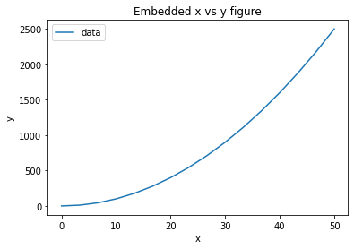

.. raw:: html

   <h1>

.. raw:: html

   

Welcome to the IDAES Stakeholder Workshop

.. raw:: html

   

.. raw:: html

   </h1>

Welcome and thank you for taking the time to attend today’s workshop.
Today we will introduce you to the fundamentals of working with the
IDAES process modeling toolset, and we will demonstrate how these tools
can be applied for optimization applications.

Today’s workshop will be conducted using Jupyter Notebooks which provide
an online, interactive Python environment for you to use (without the
need for installing anything).

Before we get started on some actual examples, let’s make sure that
everything is working correctly. The cell below contains a command to
run a simple test script that will test that everything we will need for
today is working properly.

You can execute a cell by pressing ``Shift+Enter``.

.. code:: ipython3

    run "notebook_test_script.py"

.. parsed-literal::

    Pyomo Import Checks:        Passed
    IDAES Import Checks:        FAILED
    Solver Availability Check:  Passed
    Simple Model Check:         Passed
    
    Something is not right. Please contact someone for assistance.
    

If everything worked properly, you should see a message saying
``All good!`` and a summary of all the checks that were run. If you
don’t see this, please contact someone for assistance.

Outline of Workshop
-------------------

Today’s workshop is divided into four modules which will take you
through the steps of setting up a flowsheet within the IDAES framework.

Welcome Module (this one):

-  Introduction to Jupyter notebooks and Python
-  Introduction to Pyomo

Module 1 will cover:

-  how to import models from the core IDAES model library,
-  how to create a model for a single unit operation,
-  how to define feed and operating conditions,
-  how to initialize and solve a single unit model,
-  some ways we can manipulate the model and examine the results.

Module 2 will demonstrate:

-  how to combine unit models together to form flowsheets,
-  tools to initialize and solve flowsheets with recycle loops,
-  how to optimize process operating conditions to meet product
   specifications.

Module 3 will demonstrate:

-  how to build new unit models using the IDAES tools,
-  how to include new unit models into flowsheets.

Introduction to Jupyter Notebooks and Python
--------------------------------------------

In this short notebook, we will briefly describe the uses of Jupyter
notebooks like this one, and provide you with the necessary background
in Python for this workshop. We will cover ``if`` statements, looping,
array-like containers called lists and dictionaries, as well as the use
of some external packages for working with data.

There are many additional tutorials online to learn more about the
Python syntax. One recommended by the IDAES team is
https://www.coursera.org/learn/python.

In Python, variables do not need to be declared before they are used.
You can simply define a new variable using ``x = 5``.

.. raw:: html

   

Inline Exercise: In the cell below, assign a value of 5 to the variable
x. Don’t forget to type Shift+Enter to execute the line.

.. raw:: html

   

.. code:: ipython3

    x = 5

You can easily see the value of a variable using the built-in ``print``
function. For example, to print the value of ``x`` use ``print(x)``.

.. raw:: html

   

Inline Exercise: Write the code to print the value of x. Don’t forget to
hit Shift+Enter to execute the cell.

.. raw:: html

   

.. code:: ipython3

    print(x)

.. parsed-literal::

    5
    

.. raw:: html

   

Inline Exercise: Now change the value of the x variable to 8 and execute
the cell.

.. raw:: html

   

.. code:: ipython3

    x = 8

Jupyter notebooks and execution order
~~~~~~~~~~~~~~~~~~~~~~~~~~~~~~~~~~~~~

.. raw:: html

   

Note: When using Jupyter notebooks, it is very important to know that
the cells can be executed out of order (intentionally or not). The state
of the environment (e.g., values of variables, imports, etc.) is defined
by the execution order.

.. raw:: html

   

.. raw:: html

   

Inline Exercise: To see this concept, select the cell above that
contained the print statement and execute the cell again using
Shift+Enter.

.. raw:: html

   

You should see that the value ``8`` is now printed. This may seem
problematic if you are used to programming in environments where the
state is linked to the order of the commands as *written*, not as
*executed*.

**Again, notice that the state of the environment is determined by the
execution order.**

Note also that the square brackets to the left of the cell show the
order that cells were executed. If you scroll to the top, you should see
that the code cells show an execution order of ``[1]``, ``[2]``,
``[5]``, and ``[4]``, indicating the actual execution order.

There are some useful menu commands at the top of the Jupyter notebook
to help with these problems and make sure you retain the execution order
as expected.

Some important commands to remember: \* You can clear the current state
with the menu item ``Kernel | Restart & Clear Output`` \* It is often
useful to clear the state using the menu command just described, and
then execute all the lines **above the currently selected cell** using
``Cell | Run All Above``. \* You can clear all the state and re-run the
entire notebook using ``Kernel | Restart & Run All``.

To show the use of these commands, complete the following.

.. raw:: html

   

Inline Exercise:

.. raw:: html

   <ul>

.. raw:: html

   <li>

Clear the current state (using Kernel \| Restart & Clear Output). You
should notice that the square brackets that listed the execution order
are all now empty.

.. raw:: html

   </li>

.. raw:: html

   <li>

Select the cell immediately below this text

.. raw:: html

   <li>

Re-run all the code up to this point (Cell \| Run All Above). You should
now see that the square brackets indicate the expected execution order.

.. raw:: html

   </li>

.. raw:: html

   <li>

Print the value of x again using the print function. You should see the
value 8 printed, while the earlier cell printing x shows the value of 5
as expected.

.. raw:: html

   </li>

.. raw:: html

   </ul>

.. raw:: html

   

.. code:: ipython3

    print(x)

.. parsed-literal::

    8
    

Python ``if`` statements
~~~~~~~~~~~~~~~~~~~~~~~~

In the code below, we show an example of an ``if`` statement in Python.

.. code:: python

   temp = 325
   # some other code
   if temp > 320:
       print('temperature is too high')
   elif x < 290:
       print('temperature is too low')
   else:
       print('temperature is just right')

.. raw:: html

   

Note: You will notice that there are no braces to separate blocks in the
if-else tree. In Python, indentation is used to delineate blocks of code
throughout Python (e.g., if statements, for loops, functions, etc.). The
indentation in the above example is not only to improve legibility of
the code. It is necessary for the code to run correctly. As well, the
number of spaces required to define the indentation is arbitrary, but it
must be consistent throughout the code. For example, we could use 3
spaces (instead of the 4 used in the example above, but we could not use
3 for one of the blocks and 4 for another).

.. raw:: html

   

Using the syntax above for the ``if`` statement, write the following
code.

.. raw:: html

   

Inline Exercise:

.. raw:: html

   <ul>

.. raw:: html

   <li>

set the value of the variable T_degC to 20

.. raw:: html

   </li>

.. raw:: html

   <li>

convert this from degrees Celsius to degrees Fahrenheit (use variable
name T_degF)

.. raw:: html

   </li>

.. raw:: html

   <li>

write an ``if`` statement that prints a message if the degrees
Fahrenheit are below 70

.. raw:: html

   </li>

.. raw:: html

   </ul>

.. raw:: html

   

.. code:: ipython3

    T_degC = 20
    # some other code
    T_degF = (T_degC * 9.0/5.0) + 32.0
    
    # Todo: put the if statement here
    if T_degF < 70:
        print('The room is too cold.')

.. parsed-literal::

    The room is too cold.
    

Python list containers
~~~~~~~~~~~~~~~~~~~~~~

Now we will illustrate the use of lists in Python. Lists are similar to
vectors or arrays in other languages. A list in Python is indexed by
integers from 0 up to the length of the array minus 1. The list can
contain standard types (int, float, string), or other objects.

In the next inline exercise, we will create a list that contains the
values from 0 to 50 by steps of 5 using a for loop. Note that the python
function ``range(n)`` can be used to iterate from 0 to (n-1) in a for
loop. Also note that lists have an ``append`` method which adds an entry
to the end of the list (e.g., if the list ``l`` currently has 5
elements, then ``l.append('temp')`` will add the string “temp” as the
sixth element). Print the new list after the for loop. If this is done
correctly, you should see:
``[0, 5, 10, 15, 20, 25, 30, 35, 40, 45, 50]`` printed after the cell.

.. raw:: html

   

Inline Exercise: Complete the code block below to create the desired
list and print the result.

.. raw:: html

   

.. code:: ipython3

    # Create a list with the values 0 to 50 with steps of 5.
    xlist = list()
    for i in range(11):
        # Todo: use the append method of list to append the correct value
        xlist.append(i*5)
    
    print(xlist) # Todo: print the value of xlist to verify the results

.. parsed-literal::

    [0, 5, 10, 15, 20, 25, 30, 35, 40, 45, 50]
    

You can easily check the length of a list using the python ``len(l)``
function.

.. raw:: html

   

Inline Exercise: Print the length of ``xlist``. It should be 11.

.. raw:: html

   

.. code:: ipython3

    print(len(xlist)) # Todo: print the len of the list

.. parsed-literal::

    11
    

If you have a list of values or objects, it is easy to iterate through
that list in a for loop. In the next inline exercise, we will create
another list, ``ylist`` where each of the values is equal to the
corresponding value in ``xlist`` squared. That is, :math:`y_i = x_i^2`.

.. raw:: html

   

Inline Exercise: Modify the code below to create ylist as described
above. Print the values in ylist to check the result.

.. raw:: html

   

.. code:: ipython3

    ylist = list()
    
    # Todo: define the for loop to add elements to ylist using the values in xlist
    for x in xlist:
        ylist.append(x**2)
    
    print(ylist)

.. parsed-literal::

    [0, 25, 100, 225, 400, 625, 900, 1225, 1600, 2025, 2500]
    

Python dictionary containers
~~~~~~~~~~~~~~~~~~~~~~~~~~~~

Another valuable data structure in Python are *dictionaries*.
Dictionaries are an associative array; that is, a map from keys to
values or objects. The keys can be *almost* anything, including floats,
integers, and strings. The code below shows an example of creating a
dictionary (here, to store the areas of some of the states).

.. raw:: html

   

Inline Exercise: Execute the lines below to see the areas dictionary.

.. raw:: html

   

.. code:: ipython3

    areas = dict()
    areas['South Dakota'] = 199742               
    areas['Oklahoma'] = 181035
    print(areas)

.. parsed-literal::

    {'South Dakota': 199742, 'Oklahoma': 181035}
    

Dictionaries can contain mixed types (i.e., it is valid to add
``areas['Texas'] = 'Really big!'``) but this may lead to unpredictable
behavior if the different types are unexpected in other parts of the
code.

You can loop through dictionaries in different ways. For example,

.. code:: python

   d = {'A': 2, 'B': 4, 'D': 16}
   for k in d.keys():
       # loop through the keys in the dictionary
       # access the value with d[k]
       print('key=', k, 'value=', d[k])
       
   for v in d.values():
       # loop through the values in the dictionary, ignoring the keys
       print('value=', v)
       
   for k,v in d.items():
       # loop through the entries in the dictionary, retrieving both
       # the key and the value
       print('key=', k, 'value=', v)

.. raw:: html

   

Inline Exercise: The areas listed above for the two states are in square
kilometers. Modify the loop below to create a new dictionary that
contains the areas in square miles. Print the new dictionary to verify
the correct behavior. Note that 1 kilometer is equal to 0.62137 miles.

.. raw:: html

   

.. code:: ipython3

    areas_mi = dict()
    for state_name, area in areas.items():
        # Todo: convert the area to sq. mi and assign to the areas_mi dict.
        areas_mi[state_name] = area*(0.62137**2)
    print(areas_mi)

.. parsed-literal::

    {'South Dakota': 77120.5214053598, 'Oklahoma': 69897.7360425915}
    

Matplotlib for generating figures
~~~~~~~~~~~~~~~~~~~~~~~~~~~~~~~~~

We will now briefly explore the use of the ``matplotlib`` package to
generate figures. Before we do this, we will introduce some other
helpful tools.

Another effective way to create a list of evenly spaced numbers (e.g.,
for plotting or other computation) is to use the ``linspace`` function
from the ``numpy`` package (more information
`here <https://www.numpy.org/devdocs/>`__). Let’s import the ``numpy``
package and use linspace function to create a list of 15 evenly spaced
intervals (that is, 16 points) from 0 to 50 and store this in ``xlist``.
We will also create the ``ylist`` that corresponds to the square of the
values in ``xlist``. Note, we must first import the ``numpy`` package.

.. raw:: html

   

Inline Exercise: Execute the next two cells to see the output.

.. raw:: html

   

.. code:: ipython3

    import numpy as np

.. code:: ipython3

    xlist = list(np.linspace(0,50,16))
    ylist = [x**2 for x in xlist]
    print(xlist)
    print(ylist)

.. parsed-literal::

    [0.0, 3.3333333333333335, 6.666666666666667, 10.0, 13.333333333333334, 16.666666666666668, 20.0, 23.333333333333336, 26.666666666666668, 30.0, 33.333333333333336, 36.66666666666667, 40.0, 43.333333333333336, 46.66666666666667, 50.0]
    [0.0, 11.111111111111112, 44.44444444444445, 100.0, 177.7777777777778, 277.7777777777778, 400.0, 544.4444444444446, 711.1111111111112, 900.0, 1111.1111111111113, 1344.4444444444448, 1600.0, 1877.777777777778, 2177.7777777777783, 2500.0]
    

This printed output is not a very effective way to communicate these
results. Let’s use matplotlib to create a figure of x versus y. A full
treatment of the ``matplotlib`` package is beyond the scope of this
tutorial, and further documentation can be found
`here <https://matplotlib.org/>`__. For now, we will import the plotting
capability and show how to generate a straightforward figure. You can
consult the documentation for matplotlib for further details.

.. raw:: html

   

Inline Exercise: Execute the next two cells to see the output.

.. raw:: html

   

.. code:: ipython3

    import matplotlib.pyplot as plt

.. code:: ipython3

    plt.plot(xlist, ylist)
    plt.title('Embedded x vs y figure')
    plt.xlabel('x')
    plt.ylabel('y')
    plt.legend(['data'])
    plt.show()

Next, we will use what you have learned so far to create a plot of
``sin(x)`` for ``x`` from 0 to :math:`2 \pi` with 100 points. Note, you
can get the ``sin`` function and the value for :math:`\pi` from the
``math`` package.

.. raw:: html

   

Inline Exercise: Execute the import statement in the next cell, and then
complete the missing code in the following cell to create the figure
discussed above.

.. raw:: html

   

.. code:: ipython3

    import math

.. code:: ipython3

    x = list(np.linspace(0,2*math.pi, 100))
    
    # Todo: create the list for y
    y = []
    for xv in x:
        y.append(math.sin(xv))
    
    # Todo: Generate the figure
    plt.plot(x, y)
    plt.title('Trig: sin function')
    plt.xlabel('x in radians')
    plt.ylabel('sin(x)')
    plt.show()

.. image:: output_34_0.png

Further Information
~~~~~~~~~~~~~~~~~~~

Further information of the packages mentioned above can be found using
the following links:

-  `numpy <https://www.numpy.org/devdocs/>`__
-  `matplotlib <https://matplotlib.org/>`__

Introduction to Pyomo
---------------------

`Pyomo <www.pyomo.org>`__ is an object-oriented, python-based package
for equation-oriented (or *algebraic*) modeling and optimization, and
the IDAES framework is built upon the Pyomo package. IDAES extends the
Pyomo package and defines a class heirarchy for flowsheet based
modeling, including definition of property packages, unit models, and
flowsheets.

The use of IDAES does not require extensive knowledge about Pyomo,
however, it can be beneficial to have some familiarity with the Pyomo
package for certain tasks: \* IDAES models are open, and you can
interrogating the underlying Pyomo model to view the variables,
constraints, and objective functions defined in the model. \* You can
use Pyomo components to define your objective function or to create
additional constraints. \* Since IDAES models **are** Pyomo models, any
advanced meta-algorithms or analysis tools that can be developed and/or
used on a Pyomo model can also be used on an IDAES model.

A full tutorial on Pyomo is beyond the scope of this workshop, however
in this section we will briefly cover the commands required to specify
an objective function or add a constraint to an existing model.

In the next cell, we will create a Pyomo model, and add a couple of
variables to that model. When using IDAES, you will define a flowsheet
and the addition of variables and model equations will be handled by the
IDAES framework.

.. raw:: html

   

Inline Exercise: Execute the following cell to create a Pyomo model with
some variables that will be used later.

.. raw:: html

   

.. code:: ipython3

    from pyomo.environ import ConcreteModel, Var
    model = ConcreteModel()
    model.x = Var()
    model.y = Var()

The Pyomo syntax to define a scalar objective function is shown below.
This defines the objective function as :math:`x^2`. By default Pyomo
models (and IDAES models) seek to *minimize* the objective function.

.. code:: python

   model.obj = Objective(expr=model.x**2)

To maximize a quantity, include the keyword argument ``sense=maximize``
as in the following:

.. code:: python

   model.obj = Objective(expr=model.y, sense=maximize)

Note that ``Objective`` and ``maximize`` would need to be imported from
``pyomo.environ``.

The Pyomo syntax to define a scalar constraint is shown below. This code
defines the equality constraint :math:`x^2 + y^2 = 1`.

.. code:: python

   model.on_unit_circle_con = Constraint(expr=model.x**2 + model.y**2 == 1)

Pyomo also supports inequalities. For example, the code for the
inequality constraint :math:`x^2 + y^2 \le 1` is given as the following.

.. code:: python

   model.inside_unit_circle_con = Constraint(expr=model.x**2 + model.y**2 <= 1)

Note that, as before, we would need to include the appropriate imports.
In this case ``Constraint`` would need to be imported from
``pyomo.environ``.

Using the syntax shown above, we will now add the objective function:
:math:`\min x^2 + y^2` and the constraint :math:`x + y = 1`.

.. raw:: html

   

Inline Exercise: Complete the missing code in the cell below. If this is
done correctly, after executing the cell, you should see the log output
from the solver and the printed solution should show that x, y, and the
objective value are all equal to 0.5.

.. raw:: html

   

.. code:: ipython3

    from pyomo.environ import Objective, Constraint, value, SolverFactory
    
    # Todo: add the objective function here
    model.obj = Objective(expr=model.x**2 + model.y**2)
    
    # Todo: add the constraint here
    model.con = Constraint(expr=model.x + model.y == 1)
    
    # now solve the problem
    status = SolverFactory('ipopt').solve(model, tee=True) # tee=True shows the solver log
    
    # print the values of x, y, and the objective function at the solution
    # Note that the results are automatically stored in the model variables
    print('x =', value(model.x))
    print('y =', value(model.y))
    print('obj =', value(model.obj))

.. parsed-literal::

    Ipopt 3.12.13: 
    
    ******************************************************************************
    This program contains Ipopt, a library for large-scale nonlinear optimization.
     Ipopt is released as open source code under the Eclipse Public License (EPL).
             For more information visit http://projects.coin-or.org/Ipopt
    
    This version of Ipopt was compiled from source code available at
        https://github.com/IDAES/Ipopt as part of the Institute for the Design of
        Advanced Energy Systems Process Systems Engineering Framework (IDAES PSE
        Framework) Copyright (c) 2018-2019. See https://github.com/IDAES/idaes-pse.
    
    This version of Ipopt was compiled using HSL, a collection of Fortran codes
        for large-scale scientific computation.  All technical papers, sales and
        publicity material resulting from use of the HSL codes within IPOPT must
        contain the following acknowledgement:
            HSL, a collection of Fortran codes for large-scale scientific
            computation. See http://www.hsl.rl.ac.uk.
    ******************************************************************************
    
    This is Ipopt version 3.12.13, running with linear solver ma27.
    
    Number of nonzeros in equality constraint Jacobian...:        2
    Number of nonzeros in inequality constraint Jacobian.:        0
    Number of nonzeros in Lagrangian Hessian.............:        2
    
    Total number of variables............................:        2
                         variables with only lower bounds:        0
                    variables with lower and upper bounds:        0
                         variables with only upper bounds:        0
    Total number of equality constraints.................:        1
    Total number of inequality constraints...............:        0
            inequality constraints with only lower bounds:        0
       inequality constraints with lower and upper bounds:        0
            inequality constraints with only upper bounds:        0
    
    iter    objective    inf_pr   inf_du lg(mu)  ||d||  lg(rg) alpha_du alpha_pr  ls
       0  0.0000000e+00 1.00e+00 0.00e+00  -1.0 0.00e+00    -  0.00e+00 0.00e+00   0
       1  5.0000000e-01 0.00e+00 0.00e+00  -1.7 5.00e-01    -  1.00e+00 1.00e+00h  1
    
    Number of Iterations....: 1
    
                                       (scaled)                 (unscaled)
    Objective...............:   5.0000000000000000e-01    5.0000000000000000e-01
    Dual infeasibility......:   0.0000000000000000e+00    0.0000000000000000e+00
    Constraint violation....:   0.0000000000000000e+00    0.0000000000000000e+00
    Complementarity.........:   0.0000000000000000e+00    0.0000000000000000e+00
    Overall NLP error.......:   0.0000000000000000e+00    0.0000000000000000e+00
    
    
    Number of objective function evaluations             = 2
    Number of objective gradient evaluations             = 2
    Number of equality constraint evaluations            = 2
    Number of inequality constraint evaluations          = 0
    Number of equality constraint Jacobian evaluations   = 2
    Number of inequality constraint Jacobian evaluations = 0
    Number of Lagrangian Hessian evaluations             = 1
    Total CPU secs in IPOPT (w/o function evaluations)   =      0.001
    Total CPU secs in NLP function evaluations           =      0.000
    
    EXIT: Optimal Solution Found.
    x = 0.5
    y = 0.5
    obj = 0.5
    

Notice that the code above also imported the ``value`` function. This is
a Pyomo function that should be used to retrieve the value of variables
in Pyomo (or IDAES) models. Note that you can display the complete list
of all variables, objectives, and constraints (with their expressions)
using ``model.pprint()``. The ``display`` method is similar to the
``pprint`` method except that is shows the *values* of the constraints
and objectives instead of the underlying expressions. The ``pprint`` and
``display`` methods can also be used on individual components.

.. raw:: html

   

Inline Exercise: Execute the lines of code below to see the output from
pprint and display for a Pyomo model.

.. raw:: html

   

.. code:: ipython3

    print('*** Output from model.pprint():')
    model.pprint()
    
    print()
    print('*** Output from model.display():')
    model.display()

.. parsed-literal::

    *** Output from model.pprint():
    2 Var Declarations
        x : Size=1, Index=None
            Key  : Lower : Value : Upper : Fixed : Stale : Domain
            None :  None :   0.5 :  None : False : False :  Reals
        y : Size=1, Index=None
            Key  : Lower : Value : Upper : Fixed : Stale : Domain
            None :  None :   0.5 :  None : False : False :  Reals
    
    1 Objective Declarations
        obj : Size=1, Index=None, Active=True
            Key  : Active : Sense    : Expression
            None :   True : minimize : x**2 + y**2
    
    1 Constraint Declarations
        con : Size=1, Index=None, Active=True
            Key  : Lower : Body  : Upper : Active
            None :   1.0 : x + y :   1.0 :   True
    
    4 Declarations: x y obj con
    
    *** Output from model.display():
    Model unknown
    
      Variables:
        x : Size=1, Index=None
            Key  : Lower : Value : Upper : Fixed : Stale : Domain
            None :  None :   0.5 :  None : False : False :  Reals
        y : Size=1, Index=None
            Key  : Lower : Value : Upper : Fixed : Stale : Domain
            None :  None :   0.5 :  None : False : False :  Reals
    
      Objectives:
        obj : Size=1, Index=None, Active=True
            Key  : Active : Value
            None :   True :   0.5
    
      Constraints:
        con : Size=1
            Key  : Lower : Body : Upper
            None :   1.0 :  1.0 :   1.0
    

